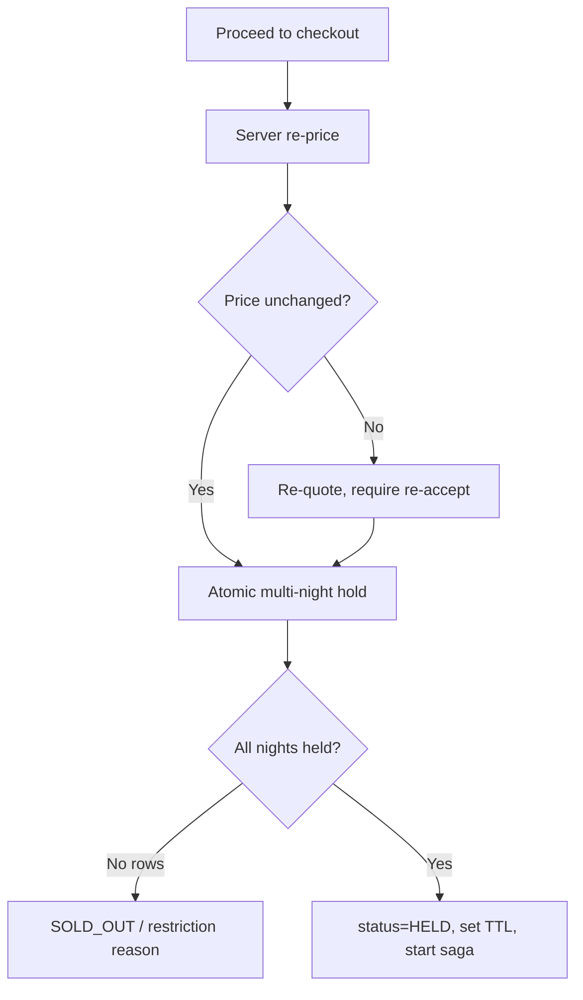

# Hotel / Stay / Villa Booking Platform — Functional Requirements & Use Cases

**Document type:** Functional Requirements Document (FRD)
**Scope:** Agoda / MakeMyTrip-class OTA + direct-booking platform
**Companion:** *System Design* doc (DB, flows, .NET architecture) — terminology is shared (ARI, hold, rate plan, saga).

---

## 1. Purpose & Conventions

This document defines **what** the system must do, before the **how**. Each requirement is testable; each use case names its actor, pre/postconditions, and the exception paths that matter.

**ID scheme**

| Prefix | Meaning |
|---|---|
| `A#` | Actor |
| `FR-M#.#` | Functional requirement (grouped by module) |
| `UC-M#.#` | Use case |
| `BR-#` | Business rule (cross-cutting, referenced by UCs) |

**Priority:** `M` = Must (MVP), `S` = Should, `C` = Could (later).

---

## 2. Actors

| ID | Actor | Description |
|---|---|---|
| A1 | **Guest (anonymous)** | Unauthenticated visitor searching/browsing; can book as guest checkout. |
| A2 | **Guest (registered)** | Authenticated traveler with profile, history, wishlist, loyalty. |
| A3 | **Host / Property Manager** | Owns/manages one or more properties; controls listing, ARI, payouts. |
| A4 | **Ops / Admin** | Internal staff: support, overrides, manual adjustments. |
| A5 | **Content Moderator** | Reviews listings, media, and guest reviews. |
| A6 | **Finance Admin** | Handles settlements, refunds, disputes, reconciliation. |
| A7 | **Channel Manager / PMS** | External system pushing ARI and pulling bookings (B2B). |
| A8 | **Payment Service Provider (PSP)** | External payment gateway (Stripe/Adyen/Razorpay). |
| A9 | **Partner / Affiliate API consumer** | B2B metasearch/affiliate booking via API. |
| A10 | **Notification System** | Internal dispatcher (email/SMS/push) — system actor. |
| A11 | **Identity Provider (IAM)** | Existing OIDC/JWT platform — authN/authZ source. |

---

## 3. Use Case Inventory

All use cases, grouped by module, with primary actor and priority.

### M1 — Search & Discovery
| UC | Name | Actor | Pri |
|---|---|---|---|
| UC-1.1 | Search stays by destination, dates, guests | A1, A2 | M |
| UC-1.2 | Filter & sort results | A1, A2 | M |
| UC-1.3 | Map-based / geo-radius search | A1, A2 | S |
| UC-1.4 | Destination autocomplete | A1, A2 | M |
| UC-1.5 | View property detail page | A1, A2 | M |
| UC-1.6 | Check live price & availability for dates | A1, A2 | M |
| UC-1.7 | Add to / manage wishlist | A2 | S |
| UC-1.8 | Compare properties | A2 | C |
| UC-1.9 | Recently viewed & recommendations | A2 | C |

### M2 — Booking / Reservation
| UC | Name | Actor | Pri |
|---|---|---|---|
| UC-2.1 | Select room/unit & rate plan | A1, A2 | M |
| UC-2.2 | Re-price & validate selection | A1, A2 | M |
| UC-2.3 | Create hold (reserve inventory) | A1, A2 | M |
| UC-2.4 | Enter guest & contact details | A1, A2 | M |
| UC-2.5 | Apply promo / coupon | A1, A2 | S |
| UC-2.6 | Review & confirm booking | A1, A2 | M |
| UC-2.7 | Handle hold expiry | System | M |
| UC-2.8 | Multi-room / multi-unit booking | A1, A2 | S |
| UC-2.9 | Guest checkout vs registered booking | A1, A2 | M |
| UC-2.10 | Add special requests | A1, A2 | C |

### M3 — Payments
| UC | Name | Actor | Pri |
|---|---|---|---|
| UC-3.1 | Authorize payment | A1, A2, A8 | M |
| UC-3.2 | Capture on confirmation | System, A8 | M |
| UC-3.3 | Pay-at-property / pay later | A1, A2 | S |
| UC-3.4 | Deposit / partial payment | A1, A2 | C |
| UC-3.5 | Handle payment failure & retry | A1, A2, A8 | M |
| UC-3.6 | 3DS / SCA challenge | A1, A2, A8 | M |
| UC-3.7 | Multi-currency payment | A1, A2 | S |
| UC-3.8 | Process refund | A6, A8 | M |
| UC-3.9 | Manage saved payment methods | A2 | S |
| UC-3.10 | Host payout / settlement | A6, A3 | S |

### M4 — Cancellation & Modification
| UC | Name | Actor | Pri |
|---|---|---|---|
| UC-4.1 | Cancel booking | A2, A4 | M |
| UC-4.2 | Compute refund per cancellation policy | System | M |
| UC-4.3 | Modify dates / guests / room | A2, A4 | S |
| UC-4.4 | Partial cancellation (one room of many) | A2, A4 | S |
| UC-4.5 | No-show handling | A3, A4 | S |
| UC-4.6 | Host-initiated cancellation | A3 | S |

### M5 — Guest Account
| UC | Name | Actor | Pri |
|---|---|---|---|
| UC-5.1 | Register / login | A1, A11 | M |
| UC-5.2 | Manage profile & preferences | A2 | M |
| UC-5.3 | View upcoming & past bookings | A2 | M |
| UC-5.4 | Manage saved travelers | A2 | C |
| UC-5.5 | Download invoice / voucher | A2 | M |
| UC-5.6 | Data export & account deletion | A2 | M |

### M6 — Host / Property Management
| UC | Name | Actor | Pri |
|---|---|---|---|
| UC-6.1 | Host onboarding & KYC verification | A3, A4 | M |
| UC-6.2 | Create / edit property listing | A3 | M |
| UC-6.3 | Manage room types / units | A3 | M |
| UC-6.4 | Upload & manage media | A3 | M |
| UC-6.5 | Configure policies & house rules | A3 | M |
| UC-6.6 | Manage rate plans | A3 | M |
| UC-6.7 | Manage rate calendar | A3 | M |
| UC-6.8 | Manage availability / allotment | A3 | M |
| UC-6.9 | Set restrictions (LOS, CTA/CTD, stop-sell) | A3 | M |
| UC-6.10 | View bookings & occupancy calendar | A3 | M |
| UC-6.11 | Respond to reviews | A3 | S |
| UC-6.12 | View earnings & payout reports | A3 | S |
| UC-6.13 | Create & manage promotions | A3 | S |

### M7 — Channel Manager / PMS Integration
| UC | Name | Actor | Pri |
|---|---|---|---|
| UC-7.1 | Connect & authenticate channel manager | A3, A7 | S |
| UC-7.2 | Ingest ARI push | A7 | S |
| UC-7.3 | Reverse-sync bookings to PMS | System, A7 | S |
| UC-7.4 | Full snapshot reconciliation | System, A7 | S |
| UC-7.5 | Detect & resolve overbooking conflict | System, A4 | M |
| UC-7.6 | Map external room codes to internal | A3, A7 | S |

### M8 — Pricing & Promotions
| UC | Name | Actor | Pri |
|---|---|---|---|
| UC-8.1 | Compute quote (pricing pipeline) | System | M |
| UC-8.2 | Create promotion / campaign | A3, A4 | S |
| UC-8.3 | Validate & redeem coupon | System | S |
| UC-8.4 | Apply member / loyalty pricing | System | C |
| UC-8.5 | Calculate taxes & fees | System | M |
| UC-8.6 | Currency conversion | System | S |

### M9 — Reviews & Ratings
| UC | Name | Actor | Pri |
|---|---|---|---|
| UC-9.1 | Submit verified post-stay review | A2 | S |
| UC-9.2 | Moderate review | A5 | S |
| UC-9.3 | View aggregated ratings | A1, A2 | S |
| UC-9.4 | Host respond to review | A3 | C |
| UC-9.5 | Report / flag review | A1, A2, A3 | C |

### M10 — Notifications
| UC | Name | Actor | Pri |
|---|---|---|---|
| UC-10.1 | Send booking confirmation + voucher | A10 | M |
| UC-10.2 | Send payment receipt / invoice | A10 | M |
| UC-10.3 | Send pre-arrival reminder | A10 | S |
| UC-10.4 | Send cancellation / modification notice | A10 | M |
| UC-10.5 | Alert host of new booking | A10 | M |
| UC-10.6 | Manage notification preferences & opt-out | A2 | S |

### M11 — Loyalty / Rewards
| UC | Name | Actor | Pri |
|---|---|---|---|
| UC-11.1 | Earn points on completed stay | System | C |
| UC-11.2 | Redeem points at checkout | A2 | C |
| UC-11.3 | Manage tier & benefits | System, A4 | C |

### M12 — Admin / Ops / Moderation
| UC | Name | Actor | Pri |
|---|---|---|---|
| UC-12.1 | Manage users & roles | A4 | M |
| UC-12.2 | Moderate listings & media | A5 | S |
| UC-12.3 | Handle dispute / chargeback | A6 | S |
| UC-12.4 | Manual booking override / adjustment | A4 | S |
| UC-12.5 | Fraud detection & blocking | A4, System | S |
| UC-12.6 | Manage master data (amenities, taxes, geo) | A4 | M |
| UC-12.7 | Review audit log | A4 | S |

### M13 — Partner / Affiliate API (B2B)
| UC | Name | Actor | Pri |
|---|---|---|---|
| UC-13.1 | Authenticate partner & enforce rate limits | A9 | C |
| UC-13.2 | Search via API | A9 | C |
| UC-13.3 | Book via API | A9 | C |
| UC-13.4 | Manage commission / markup | A4, A6 | C |

### M14 — Reporting & Analytics
| UC | Name | Actor | Pri |
|---|---|---|---|
| UC-14.1 | Operational dashboards | A4 | S |
| UC-14.2 | Conversion funnel reporting | A4 | S |
| UC-14.3 | Financial reconciliation report | A6 | S |

---

## 4. Cross-Cutting Business Rules

These are referenced by multiple use cases.

- **BR-1 (No overbooking):** confirmed `units_sold` for any `(room_type, night)` must never exceed `total_allotment`. Inventory truth is asserted only at hold/confirm time, never from the search index.
- **BR-2 (Frozen quote):** the price the guest accepts at hold time is the contract. Bookings store a per-night breakdown and are never recomputed against live rates.
- **BR-3 (Hold TTL):** an inventory hold expires after a configurable window (default 12 min). On expiry, held inventory is released automatically.
- **BR-4 (Timezone correctness):** all check-in/check-out, cutoff, and cancellation-window math is computed in the **property's** IANA timezone, not the server's or guest's.
- **BR-5 (Idempotency):** all external/state-changing operations (payment auth/capture/refund, channel sync, public booking API) are idempotent via a client-supplied or derived key.
- **BR-6 (Verified reviews):** only a guest with a `COMPLETED` booking for a property may review it.
- **BR-7 (Refund authority):** refund amount is derived from the rate plan's cancellation policy evaluated against `now` vs check-in; manual overrides require A4/A6 and are audited.
- **BR-8 (Data privacy):** guest PII supports export and erasure (anonymize while retaining financial records for legal retention).
- **BR-9 (Tenancy isolation):** a host may only read/write data for properties they own; enforced at the row level.

---

## 5. Detailed Use Cases — Critical Path

Full template for the high-risk / high-complexity flows.

### UC-1.1 — Search stays by destination, dates, guests `[M]`
**Actor:** A1, A2
**Precondition:** Catalog and search index are populated.
**Trigger:** Guest submits destination + check-in/out + guest count.

**Main flow**
1. Guest enters destination (city/region/landmark/property), dates, occupancy.
2. System validates dates (check-in ≥ today, check-out > check-in, within booking horizon).
3. System queries the search read model by geo + static filters, returns ranked candidates.
4. System resolves coarse price + availability band for the result page (cache-first).
5. System returns paginated results with per-property indicative price for the dates.

**Alternate flows**
- **A1 — No dates supplied:** return browsable results with "from" pricing; defer availability to detail page.
- **A2 — Property-name search:** route to UC-1.5 directly if exact match.

**Exception flows**
- **E1 — Invalid date range:** reject with validation message; no search executed.
- **E2 — Zero results:** offer relaxed criteria (wider radius, nearby dates, fewer filters).

**Postcondition:** result set rendered; search event logged for funnel analytics.
**Business rules:** BR-4 (date math in destination timezone for "today").

---

### UC-2.3 — Create hold (reserve inventory) `[M]`
**Actor:** A1, A2
**Precondition:** Guest has a validated, re-priced selection (UC-2.2); inventory exists.
**Trigger:** Guest proceeds to checkout from the selection.

**Main flow**
1. System re-prices the selection server-side (never trusts the search/client price) — BR-2.
2. System acquires a per-cart serialization lock (prevents double-submit).
3. System attempts an **atomic all-nights-or-none** hold across every night of the stay for the requested quantity.
4. On success, system sets booking `status = HELD`, `hold_expires_at = now + TTL` (BR-3), records hold rows for the reaper.
5. System returns the confirmed hold with the frozen quote and a countdown.

**Alternate flows**
- **A1 — Multi-room cart (UC-2.8):** holds are attempted per line; if any line fails, all lines in the cart roll back (cart-level atomicity).

**Exception flows**
- **E1 — One or more nights unavailable:** zero-row result → no partial hold; return SOLD_OUT and re-quote alternatives.
- **E2 — Price changed since selection:** present new quote; require explicit re-acceptance before hold.
- **E3 — Restriction violated (min/max LOS, CTA/CTD, stop-sell):** reject with the specific restriction reason.

**Postcondition (success):** inventory `units_held` incremented for all nights; booking is HELD; saga started.
**Postcondition (failure):** no inventory change; guest informed with actionable reason.
**Business rules:** BR-1, BR-2, BR-3.

---

### UC-2.6 / UC-3.1–3.2 — Review, confirm & pay (booking saga) `[M]`
**Actor:** A1, A2, A8
**Precondition:** Valid HELD booking within its TTL.
**Trigger:** Guest submits payment on the review screen.

**Main flow**
1. Guest reviews frozen quote, guest details, and cancellation terms; submits payment.
2. System sends an **authorize** request to the PSP with an idempotency key (BR-5).
3. PSP authorizes; system **commits** inventory (`units_held → units_sold`) atomically.
4. System **captures** payment (or schedules capture per rate plan).
5. System sets `status = CONFIRMED`, generates booking reference + voucher.
6. System emits `BookingConfirmed` → triggers UC-10.1 (guest), UC-10.5 (host), search reindex, payout scheduling.

**Alternate flows**
- **A1 — Pay-at-property (UC-3.3):** skip auth/capture; confirm on hold; collect a guarantee per policy.
- **A2 — 3DS/SCA challenge (UC-3.6):** suspend, present challenge, resume on callback within TTL.

**Exception flows**
- **E1 — Authorization declined:** booking stays HELD; allow retry (UC-3.5) until TTL; on final failure, release hold.
- **E2 — Hold expired before payment (UC-2.7):** reject; re-attempt hold (may now be sold out).
- **E3 — Capture fails after auth:** booking confirmed but flagged for finance retry; never block the guest on capture.
- **E4 — Inventory commit fails (rare race):** compensate — void authorization, surface SOLD_OUT, release.

**Postcondition (success):** CONFIRMED booking, captured/scheduled payment, notifications dispatched, host calendar updated.
**Business rules:** BR-1, BR-2, BR-5.

---

### UC-2.7 — Handle hold expiry `[M]`
**Actor:** System (reaper)
**Precondition:** Holds exist with `expires_at` in the past and not released.
**Trigger:** Scheduled reaper tick (and immediate trigger on abandonment).

**Main flow**
1. Reaper selects expired, unreleased holds.
2. For each, decrement `units_held` for the affected nights atomically.
3. Mark hold released; set booking `status = EXPIRED` if still HELD.
4. Void any outstanding payment authorization (idempotent).

**Exception flows**
- **E1 — Booking already CONFIRMED:** skip (commit won the race); no inventory change.

**Postcondition:** released inventory becomes sellable again; no orphaned holds.
**Business rules:** BR-1, BR-3, BR-5.

---

### UC-4.1 / UC-4.2 — Cancel booking & compute refund `[M]`
**Actor:** A2 (guest) or A4 (ops on behalf)
**Precondition:** Booking is CONFIRMED and not yet checked out.
**Trigger:** Cancellation requested.

**Main flow**
1. System loads the rate plan's cancellation policy.
2. System evaluates `now` vs `check_in` **in the property timezone** (BR-4) to determine the refund tier.
3. System computes refund amount (0% / partial / 100%) per policy (BR-7).
4. System restores inventory (`units_sold -= qty`) for all nights **before** issuing the refund.
5. System issues an idempotent refund to the PSP for the computed amount.
6. System sets `status = CANCELLED`; emits `BookingCancelled` → UC-10.4, search reindex, payout reversal.

**Alternate flows**
- **A1 — Non-refundable plan:** refund = 0; still restore inventory and notify.
- **A2 — Partial cancellation (UC-4.4):** restore and refund only the cancelled line; booking stays CONFIRMED.
- **A3 — Host-initiated (UC-4.6):** may trigger guest compensation and host penalty per platform policy.

**Exception flows**
- **E1 — Refund fails at PSP:** inventory already restored; refund queued for idempotent retry; finance alerted.
- **E2 — Within check-in window / already checked in:** disallow self-service; route to A4.

**Postcondition:** inventory restored, refund processed/queued, all parties notified.
**Business rules:** BR-4, BR-5, BR-7.

---

### UC-7.2 / UC-7.5 — Ingest ARI push & resolve overbooking `[S/M]`
**Actor:** A7 (channel manager / PMS), System, A4
**Precondition:** Channel connection established and room-code mapping configured (UC-7.6).
**Trigger:** External system pushes an availability/rate/restriction delta.

**Main flow**
1. System authenticates the push and validates the message version/sequence (BR-5).
2. System enqueues the delta on a **per-property ordered** queue.
3. Worker maps external room codes → internal room types, applies the delta to `inventory_calendar` / `rate_calendar`.
4. System emits `AvailabilityChanged` → search reindex of the price band.

**Alternate flows**
- **A1 — Full snapshot (UC-7.4):** replace the property's calendar window wholesale; reconcile counters.

**Exception flows**
- **E1 — Stale/out-of-order message:** drop (sequence older than applied).
- **E2 — Unmapped room code:** quarantine the delta; alert host (UC-7.6 needed).
- **E3 — Overbooking detected (external sale not yet synced):** flag the affected booking, run resolution — auto-rebook to equivalent inventory or escalate to A4 with guest-comp workflow.

**Postcondition:** internal ARI reflects external state in order; conflicts surfaced, never silently lost.
**Business rules:** BR-1, BR-5.

---

### UC-6.1 — Host onboarding & KYC verification `[M]`
**Actor:** A3 (host), A4 (reviewer)
**Precondition:** Prospective host authenticated via IAM (A11).
**Trigger:** Host applies to list a property.

**Main flow**
1. Host submits business/identity details, payout account, and tax info.
2. System runs KYC/AML checks (provider or manual queue).
3. A4 reviews flagged cases; approves or rejects.
4. On approval, host gains listing permissions (role granted via IAM).

**Exception flows**
- **E1 — KYC fails:** host blocked from going live; reason recorded; appeal path provided.

**Postcondition:** host can create listings (UC-6.2) but properties remain DRAFT until content moderation (UC-12.2).
**Business rules:** BR-9.

---

## 6. Compact Use Cases — Supporting Set

Brief specs (actor · trigger · essence · key exceptions). Detail expands during sprint grooming.

**M1 Search**
- **UC-1.2 Filter & sort** — A1/A2 adjust facets (price, stars, amenities, type, distance) and sort (price/rating/distance/popularity); re-query read model.
- **UC-1.3 Map search** — geo-radius / viewport query; clustering at zoom-out.
- **UC-1.4 Autocomplete** — type-ahead over destinations + property names; debounced.
- **UC-1.5 Property detail** — render gallery, amenities, policies, room types, reviews; calls UC-1.6.
- **UC-1.6 Live price/availability** — exact quote for selected dates via Pricing + ARI; *advisory only* until hold.
- **UC-1.7 Wishlist** — A2 saves/removes properties; persisted to profile.
- **UC-1.8 Compare** — side-by-side of saved properties.
- **UC-1.9 Recommendations** — recently viewed + personalized rail.

**M2 Booking**
- **UC-2.1 Select room & rate plan** — choose unit + plan (refundable vs not, board basis).
- **UC-2.2 Re-price & validate** — server recomputes; flags drift before hold (feeds UC-2.3).
- **UC-2.4 Guest details** — lead guest + contact; validation; prefill for A2.
- **UC-2.5 Apply promo** — UC-8.3 validates coupon; recompute quote. *Exc:* invalid/expired/ineligible → reject, keep base quote.
- **UC-2.8 Multi-room** — multiple lines in one cart; cart-level atomic hold.
- **UC-2.9 Guest vs registered** — guest checkout requires email; offer post-booking account claim.
- **UC-2.10 Special requests** — free-text/structured (late check-in, bed type); non-binding.

**M3 Payments**
- **UC-3.3 Pay-at-property** — confirm without capture; guarantee per policy.
- **UC-3.4 Deposit** — partial now, balance by due date; schedule balance reminder.
- **UC-3.5 Failure & retry** — bounded retries within hold TTL; clear decline reasons.
- **UC-3.6 3DS/SCA** — challenge + callback resume.
- **UC-3.7 Multi-currency** — display + settle currency; snapshot FX onto booking (UC-8.6).
- **UC-3.8 Refund** — see UC-4.2; idempotent PSP refund.
- **UC-3.9 Saved methods** — tokenized at PSP; no raw card data stored.
- **UC-3.10 Host payout** — settle host share post-stay minus commission; statement generated.

**M4 Cancellation/Modification**
- **UC-4.3 Modify** — date/guest/room change = re-quote + re-hold delta; price difference charged/refunded.
- **UC-4.5 No-show** — host/ops marks no-show; apply no-show charge per policy.

**M5 Account**
- **UC-5.1 Register/login** — delegated to IAM (A11); social/email.
- **UC-5.2 Profile/preferences** — contact, language, currency, comms prefs.
- **UC-5.3 Bookings list** — upcoming/past with status and actions.
- **UC-5.4 Saved travelers** — reusable guest profiles.
- **UC-5.5 Invoice/voucher** — download PDF.
- **UC-5.6 Data export/deletion** — BR-8 export + erasure workflow.

**M6 Host**
- **UC-6.2 Listing** — create/edit property attributes, address, geo.
- **UC-6.3 Room types/units** — define sellable units, occupancy, count.
- **UC-6.4 Media** — upload/order images; primary photo; moderation queue.
- **UC-6.5 Policies** — cancellation, house rules, check-in/out times.
- **UC-6.6 Rate plans** — define plans + board basis + refundability.
- **UC-6.7 Rate calendar** — set/bulk-edit nightly prices.
- **UC-6.8 Availability** — set allotment per night; bulk edit.
- **UC-6.9 Restrictions** — min/max LOS, CTA/CTD, stop-sell per night.
- **UC-6.10 Bookings/calendar** — occupancy view, arrivals/departures.
- **UC-6.11 Respond to reviews** — public reply.
- **UC-6.12 Earnings/payouts** — statements, upcoming payouts.
- **UC-6.13 Promotions** — early-bird, last-minute, LOS discounts (UC-8.2).

**M7 Channel/PMS**
- **UC-7.1 Connect** — OAuth/API-key handshake; capability negotiation.
- **UC-7.3 Reverse sync** — push confirmed/cancelled bookings to PMS.
- **UC-7.4 Reconciliation** — periodic full-snapshot compare + repair.
- **UC-7.6 Room mapping** — map external↔internal room codes.

**M8 Pricing/Promotions**
- **UC-8.1 Compute quote** — base → occupancy → LOS/seasonal → promo → FX → tax (deterministic pipeline).
- **UC-8.2 Create promotion** — rule-as-data campaign with validity window.
- **UC-8.3 Coupon redemption** — validate eligibility/limits/stacking.
- **UC-8.4 Loyalty pricing** — member rates/points (M11).
- **UC-8.5 Tax & fees** — jurisdiction rules by country/city.
- **UC-8.6 Currency conversion** — snapshot FX; store rate used.

**M9 Reviews**
- **UC-9.1 Submit review** — BR-6 verified stay only; rating + text + photos.
- **UC-9.2 Moderate** — approve/reject; profanity/PII checks.
- **UC-9.3 Aggregates** — category sub-scores + overall.
- **UC-9.4 Host response** — public reply.
- **UC-9.5 Flag** — report abusive/fake review → moderation.

**M10 Notifications**
- **UC-10.1–10.5** — event-driven (confirmation, receipt, reminder, cancellation, host alert); at-least-once with templating + localization.
- **UC-10.6 Preferences/opt-out** — channel + category granularity; honor unsubscribe.

**M11 Loyalty**
- **UC-11.1 Earn** — accrue on COMPLETED stay.
- **UC-11.2 Redeem** — apply points at checkout (UC-8.4).
- **UC-11.3 Tiers** — thresholds + benefits.

**M12 Admin/Ops**
- **UC-12.1 Users/roles** — manage internal + host roles via IAM.
- **UC-12.2 Moderate listings/media** — gate DRAFT→LIVE.
- **UC-12.3 Dispute/chargeback** — evidence workflow with PSP.
- **UC-12.4 Manual override** — adjust/cancel/refund with mandatory reason + audit (BR-7).
- **UC-12.5 Fraud** — velocity/anomaly rules; block list.
- **UC-12.6 Master data** — amenities, tax tables, geo/cities.
- **UC-12.7 Audit log** — immutable trail of privileged actions.

**M13 Partner API**
- **UC-13.1 Auth/rate-limit** — partner credentials, quotas (BR-5).
- **UC-13.2 Search API** — programmatic search.
- **UC-13.3 Book API** — programmatic hold→confirm with idempotency.
- **UC-13.4 Commission/markup** — per-partner pricing rules.

**M14 Reporting**
- **UC-14.1 Dashboards** — bookings, occupancy, revenue, sync lag.
- **UC-14.2 Funnel** — search→detail→hold→confirm conversion.
- **UC-14.3 Reconciliation** — payments vs payouts vs bookings.

---

## 7. Traceability & Next Step

Each UC maps forward to a service/module in the design doc:

| Module | Owning context (design doc §2) |
|---|---|
| M1, M8 | Search, Pricing |
| M2, M4 | Booking (saga) |
| M3 | Payment |
| M6, M7 | Catalog, ARI |
| M9 | Reviews |
| M10 | Notification |
| M5, M12 | Identity / Admin |

**Recommended next step:** turn the priority-M set (the critical path: UC-1.1, 2.1–2.7, 3.1–3.2/3.5–3.6, 4.1–4.2, 6.x core, 7.5) into a sprint-1 backlog, and validate BR-1 with the concurrency load test before building anything downstream.
