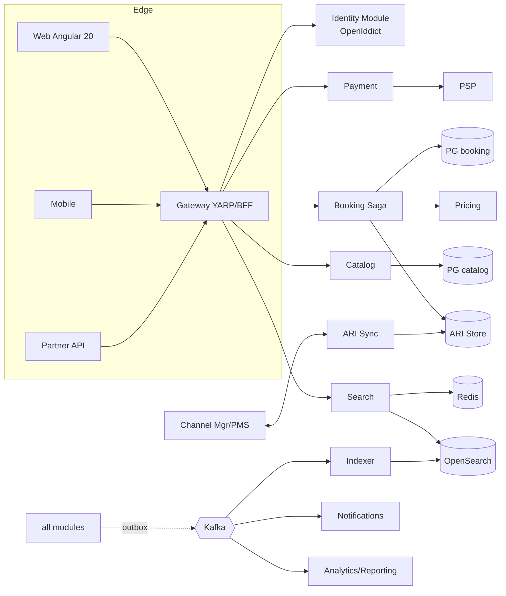

# Hotel / Stay / Villa Booking Platform — Implementation Roadmap

**Document type:** Implementation Plan & Delivery Roadmap
**Companions:** *System Design* doc (architecture, DB, flows) · *FRD* (actors, use cases UC-x.x, business rules BR-x)
**Stack:** .NET 10 / C# 14, Angular 20 (standalone + signals), Postgres + PostGIS, OpenSearch, Redis, Kafka/Azure SB, Kubernetes
**Scope correction:** this is a **standalone consumer platform** — identity/auth is built *within* this platform (ASP.NET Core Identity + OpenIddict, or Duende IdentityServer if licensing is acceptable). No external IAM dependency. The FRD actor A11 is hereby an internal module, not an external system.

---

## 1. The Full Picture

### 1.1 What "done" looks like

A production OTA-class platform where:

- A guest searches millions of property-nights in <500 ms, books with zero overbooking risk, pays in their currency, and self-serves cancellation.
- A host onboards, lists, prices, and manages availability — directly or through their PMS/channel manager.
- Ops moderates, resolves disputes, and reconciles money; finance settles host payouts automatically.
- Every state change is event-sourced through an outbox, traced end-to-end with OpenTelemetry, and idempotent at every external boundary.

### 1.2 Target system map (recap)

### 1.3 Delivery strategy in one paragraph

Build the **transactional core first and prove it under load** (Phases 0–3 culminate in Gate G1: the no-overbooking concurrency test). Money comes second (Phase 4, Gate G2: payment idempotency + reconciliation). Only then invest in the conversion surface (search, UX polish), because a beautiful funnel feeding a broken booking core is worthless. External integrations (channel managers) come after the internal model is stable — they are the operationally hardest and least controllable pieces. Everything ships behind feature flags into a single environment promotion path (dev → staging → prod) with the modular-monolith deployable from week 1.

### 1.4 Phase overview

| Phase | Name | Weeks | Gate | Headline outcome |
|---|---|---|---|---|
| 0 | Foundation & Identity | 1–4 | G0 | Walking skeleton in prod-like env, auth works |
| 1 | Catalog & Host Core | 5–9 | — | Hosts can list properties end-to-end |
| 2 | ARI & Pricing Engine | 10–14 | — | Calendars + deterministic quotes |
| 3 | Booking Core (Saga) | 15–20 | **G1** | Zero-overbooking proven under load |
| 4 | Payments | 21–25 | **G2** | Real money, idempotent, reconciled |
| 5 | Search & Discovery | 26–30 | G3 | Sub-second search funnel live |
| 6 | Cancellation, Modification & Notifications | 31–34 | — | Full booking lifecycle |
| 7 | Guest Account & Reviews | 35–38 | G4 | **Soft-launch MVP** (direct inventory) |
| 8 | Channel Manager / PMS Integration | 39–44 | **G5** | Third-party inventory at scale |
| 9 | Admin, Ops, Fraud & Reporting | 45–48 | — | Operable platform |
| 10 | Loyalty, Partner API & Scale-out | 49–54 | G6 | Growth features + extraction readiness |

~54 weeks with a deliberately conservative tail; a soft launch is possible at the end of Phase 7 (~week 38). Phases 5–7 and 8–9 have internal parallelism if you run two streams.

---

## 2. Phasing Principles

1. **Risk-first ordering.** The two ways this class of platform dies — overbooking and payment errors — are de-risked by week 25, not discovered in UAT.
2. **Gates are hard stops.** A gate failure blocks the next phase. Each gate has an executable test, not a review meeting.
3. **Vertical slices inside phases.** Every phase ships demoable end-to-end behavior (API + minimal Angular screen), never a "backend-only" phase.
4. **Bug-flagging over papering-over.** Defects found at gates are fixed at the root (schema, contract, saga) before proceeding; no compensating hacks downstream.
5. **Feature flags + dark launch.** New modules deploy dark; flags flip per-environment. Channel sync in particular runs in shadow mode (Phase 8) before taking writes.
6. **Contracts before code.** Each phase starts by freezing the module's public contract (OpenAPI + event schemas in a registry); architecture tests enforce module boundaries in CI from Phase 0.

---

## 3. Phase 0 — Foundation & Identity (Weeks 1–4)

**Objective:** a walking skeleton: one request travels Angular → Gateway → a module → Postgres → outbox → Kafka → consumer, fully traced, deployed by CI to a prod-like cluster. Identity issues real tokens.

### Scope & deliverables

**Platform engineering**
- Solution scaffold: `Platform.Gateway` (YARP), 8 module projects with `Domain/Application/Infrastructure/Api` layering, `BuildingBlocks` (Result types, CQRS pipeline, outbox, messaging abstractions).
- Architecture tests (ArchUnitNET) failing the build on cross-module infrastructure references.
- CI/CD: GitHub Actions — build, test, arch-test, container build, Helm deploy to dev/staging; trunk-based with PR gates.
- Kubernetes baseline: namespaces, secrets (external secrets operator), HPA stubs, ingress, cert-manager.
- Postgres (with PostGIS), Redis, Kafka, OpenSearch provisioned; per-module schemas + independent migration histories (EF Core migrations per module).
- Observability: OpenTelemetry SDK wired in Gateway + modules → collector → traces/metrics/logs backend; correlation id propagated from Angular.
- Transactional outbox + dispatcher (Wolverine or MassTransit) proven with one round-trip event.

**Identity module (replaces external-IAM assumption)**
- ASP.NET Core Identity + **OpenIddict** (OSS, no licensing risk): authorization-code + PKCE for Angular, client-credentials for partner API later, refresh tokens.
- Roles: `guest`, `host`, `ops`, `moderator`, `finance`, `partner` (claims-based policies per module).
- Email verification, password reset, social login (Google) stubbed for Phase 7 completion.
- Covers: **UC-5.1** (register/login), foundation for **UC-12.1** (roles).

**Angular 20 shell**
- Standalone/zoneless app shell, signal-based state, auth interceptor, route guards, design-system seed.

### Exit criteria — **Gate G0**
- [ ] One end-to-end traced request visible in the tracing UI from browser to Kafka consumer.
- [ ] Login → JWT → protected endpoint works in staging.
- [ ] CI deploys on merge; rollback demonstrated.
- [ ] Architecture test suite green and proven to fail on a seeded violation.

---

## 4. Phase 1 — Catalog & Host Core (Weeks 5–9)

**Objective:** a host can register, pass KYC, create a property with room types, media, policies — and an ops user can moderate it live. This unblocks every later phase with real seed data.

### Use cases delivered
| UC | Note |
|---|---|
| UC-6.1 | Host onboarding & KYC (provider integration stubbed → manual ops queue first) |
| UC-6.2 | Create/edit property (address, geo via PostGIS point, attributes) |
| UC-6.3 | Room types / units (`ROOM` vs `ENTIRE_UNIT` for villas) |
| UC-6.4 | Media upload (S3/Blob presigned upload, ordering, primary photo) |
| UC-6.5 | Policies & house rules (cancellation policy entities created here, *evaluated* in Phase 6) |
| UC-12.2 | Listing/media moderation queue (DRAFT → LIVE gate) |
| UC-12.6 | Master data: amenities, property types, cities/geo, tax-table *schema* |
| UC-1.5 | Property detail page — first version straight from Catalog (no search yet) |

### Key build notes
- Catalog schema per design doc §5.2; `row_version` optimistic concurrency on every host-editable entity.
- Domain events from day 1: `PropertyCreated/Updated/WentLive`, `RoomTypeChanged` — consumed by the (future) indexer; for now they land in Kafka and a dead-simple audit consumer, proving the event spine.
- BR-9 tenancy: EF Core global query filter on `host_id` + integration tests that *prove* cross-tenant reads fail.
- Angular: host portal skeleton (listing wizard), ops moderation screen.

### Exit criteria
- [ ] A scripted demo: new host → KYC approve → listing → moderation → LIVE → public detail page.
- [ ] Tenancy isolation tests green.
- [ ] 50+ seeded realistic properties (importer tool) for downstream phases.

---

## 5. Phase 2 — ARI & Pricing Engine (Weeks 10–14)

**Objective:** date-keyed inventory and rates exist with partitioning in place, and the pricing pipeline returns deterministic quotes. No booking yet — but everything booking needs.

### Use cases delivered
| UC | Note |
|---|---|
| UC-6.6 | Rate plans (refundable / non-refundable, board basis) |
| UC-6.7 | Rate calendar — single + bulk edit (date-range painter UI) |
| UC-6.8 | Availability / allotment management |
| UC-6.9 | Restrictions: min/max LOS, CTA/CTD, stop-sell |
| UC-8.1 | Quote pipeline: base → occupancy → LOS/seasonal → promo hook → FX hook → tax |
| UC-8.5 | Taxes & fees (jurisdiction rules; start with 2–3 target markets) |
| UC-8.6 | Currency conversion (FX snapshot service + stored rate) |
| UC-1.6 | Live price & availability check (advisory) — powers the detail page date-picker |

### Key build notes
- `inventory_calendar` / `rate_calendar` with **monthly range partitions** + the partition-creation job from day 1 (retrofitting partitioning is painful).
- Pricing module is **stateless/deterministic**: golden-file test suite — same inputs, byte-identical quote breakdowns. This suite becomes the regression net for every future pricing rule.
- `pricing_rule` table (rules-as-data) with the evaluation engine; only LOS + seasonal rule types implemented now, the engine is general.
- Dapper for the hot calendar read paths; EF Core for host CRUD.
- Bulk calendar writes batched + idempotent (host UIs love double-submits).

### Exit criteria
- [ ] Host sets 365 days of rates/allotment in <5 s bulk operation.
- [ ] Quote golden tests: 100% deterministic across 50 scenario fixtures (occupancy, LOS, taxes, FX).
- [ ] Calendar queries p99 <50 ms at 10k properties seeded.

---

## 6. Phase 3 — Booking Core: the Saga (Weeks 15–20)

**Objective:** the heart. Hold → confirm → expire, atomically, with **mock payment**. This phase ends at the project's most important gate.

### Use cases delivered
| UC | Note |
|---|---|
| UC-2.1 | Select room/unit & rate plan |
| UC-2.2 | Server-side re-price & validate (BR-2 frozen quote) |
| UC-2.3 | **Atomic multi-night hold** (all-nights-or-none SQL, design doc §6.2) |
| UC-2.4 | Guest & contact details capture |
| UC-2.6 | Review & confirm (mock-pay) — full saga: HELD → CONFIRMED |
| UC-2.7 | Hold expiry reaper + immediate release on abandonment |
| UC-2.8 | Multi-room cart with cart-level atomicity |
| UC-2.9 | Guest checkout (email-only) vs registered booking |
| UC-2.10 | Special requests |
| UC-6.10 | Host bookings list & occupancy calendar (reads the same truth) |
| UC-10.1 / 10.5 | First notifications: booking confirmation (guest) + new-booking alert (host) — establishes the Notification module with templating, localization, at-least-once delivery |

### Key build notes
- Saga orchestration (Wolverine saga or explicit state machine): states `DRAFT → HELD → CONFIRMED | EXPIRED | FAILED`, every transition idempotent and audited.
- The conditional-update hold SQL with row-count check is hand-written (Dapper), unit of the most intense code review of the project.
- Redis per-cart lock only to serialize double-submits — **never** as inventory truth.
- Reaper: scheduled worker + partial index on unexpired holds; race with confirm resolved by the DB (confirm flips `units_held→units_sold` in the same transaction that checks booking status).
- Booking reference generator (human-friendly, non-sequential, checksummed).

### Exit criteria — **Gate G1: the no-overbooking proof** 🔴
Executable load test, run in staging against production-spec Postgres:
- [ ] 5,000 concurrent hold attempts against a single room-night with `total_allotment = 3` → exactly 3 confirms, 0 oversell, all others get clean SOLD_OUT.
- [ ] Mixed workload: 10k concurrent multi-night holds across 100 properties for 1 hour → invariant `units_sold + units_held ≤ total_allotment` checked per-second, zero violations; zero deadlocks; hold p99 <200 ms.
- [ ] Kill the reaper mid-run, restart → all expired holds released, no orphans.
- [ ] Chaos: kill the app pod mid-saga → on restart, saga resumes or compensates; no stuck HELD bookings past TTL+grace.

**This gate is non-negotiable. Nothing in Phases 4+ starts until G1 is green.**

---

## 7. Phase 4 — Payments (Weeks 21–25)

**Objective:** replace mock-pay with a real PSP, idempotent end-to-end, and prove reconciliation.

### Use cases delivered
| UC | Note |
|---|---|
| UC-3.1 | Authorize (PSP #1 — pick the one for your launch market, e.g. Stripe or Razorpay for SG/IN) |
| UC-3.2 | Capture on confirmation (immediate or scheduled per rate plan) |
| UC-3.5 | Failure & retry within hold TTL; decline-reason mapping |
| UC-3.6 | 3DS / SCA challenge with saga suspend/resume |
| UC-3.7 | Multi-currency: display vs settlement currency, FX snapshot onto booking |
| UC-3.9 | Saved payment methods (PSP tokenization — zero raw PAN in our systems) |
| UC-10.2 | Payment receipt / invoice notification |
| UC-5.5 | Invoice/voucher PDF generation (server-side, e.g. QuestPDF) |

Deferred within module: UC-3.3 pay-at-property and UC-3.4 deposits → Phase 6 (they're policy variants once the spine works); UC-3.8 refunds → Phase 6 with cancellation; UC-3.10 payouts → Phase 9 with finance ops.

### Key build notes
- **PSP abstraction port** (`IPaymentGateway`) with one adapter now; the contract is the future-proofing, not speculative multi-PSP code.
- Idempotency keys: `booking_id + attempt_no` on every PSP call; webhook handlers idempotent by PSP event id (BR-5).
- Webhook ingestion is the source of truth for async PSP state; poll-reconcile job covers missed webhooks.
- E3 path from FRD (capture fails after auth): booking stays CONFIRMED, finance retry queue — never block the guest.
- PCI scope: SAQ-A posture — hosted fields / PSP elements in Angular; our servers never see card data.

### Exit criteria — **Gate G2: money correctness** 🔴
- [ ] Idempotency torture test: every PSP call replayed 5× under injected timeouts → zero duplicate charges/refunds in PSP sandbox ledger.
- [ ] 3DS happy + abandon paths green; abandoned challenge releases the hold at TTL.
- [ ] End-of-day reconciliation report: PSP sandbox ledger ⟷ `payment` table, zero unexplained deltas across a 1k-booking simulated day.
- [ ] Webhook outage drill: 30-min webhook blackhole → poll-reconciler converges all states.

---

## 8. Phase 5 — Search & Discovery (Weeks 26–30)

**Objective:** the conversion surface. Indexer projects catalog + price bands into OpenSearch; full search funnel live.

### Use cases delivered
| UC | Note |
|---|---|
| UC-1.1 | Search by destination/dates/guests |
| UC-1.2 | Filters & sort (price, stars, amenities, type, distance, rating-placeholder) |
| UC-1.3 | Map/geo-radius search with clustering |
| UC-1.4 | Destination + property autocomplete |
| UC-1.7 | Wishlist |
| UC-1.9 | Recently viewed (recommendations rail = simple heuristics now, ML seam later) |
| UC-14.2 | Funnel instrumentation: search→detail→hold→confirm events into analytics topic |

(UC-1.8 compare stays `C`-priority → Phase 10 backlog.)

### Key build notes
- Indexer consumes `PropertyWentLive/Updated`, `AvailabilityChanged`, `RateChanged` → upserts denormalized docs; full-reindex job for disaster recovery + mapping changes (blue/green index alias swap).
- Search-time price resolution per design doc §6.1: OpenSearch for candidates, Redis (1–5 min TTL) for exact price+avail of the visible page, Pricing on miss.
- Ranking v1: deterministic score (quality × price-competitiveness × distance); leave the feature-vector seam for ML ranking (Phase 10+).
- Angular: results page with virtualized list + map split view, skeleton loading, URL-addressable search state.

### Exit criteria — **Gate G3: funnel performance**
- [ ] Search p95 <500 ms, autocomplete p95 <100 ms at 100k indexed properties (synthetic).
- [ ] Index lag: rate/availability change visible in search ≤2 min p99.
- [ ] Full reindex of 100k properties <30 min with zero downtime (alias swap).
- [ ] Funnel events land in analytics topic with session stitching verified.

---

## 9. Phase 6 — Cancellation, Modification & Lifecycle (Weeks 31–34)

**Objective:** complete the booking lifecycle: cancel, refund, modify, no-show, plus the deferred payment variants.

### Use cases delivered
| UC | Note |
|---|---|
| UC-4.1 | Guest/ops cancellation |
| UC-4.2 | Refund computation per policy — **property-timezone evaluation (BR-4)** with a dedicated test matrix across DST/UTC-offset edge cases |
| UC-3.8 | PSP refund (idempotent; inventory restored *before* refund per design doc §6.3) |
| UC-4.3 | Modification = re-quote + delta hold + price-difference charge/refund |
| UC-4.4 | Partial cancellation (line-level) |
| UC-4.5 | No-show marking + charge per policy |
| UC-4.6 | Host-initiated cancellation + guest-comp workflow |
| UC-3.3 | Pay-at-property (guarantee, no capture) |
| UC-3.4 | Deposit / balance schedule + reminder |
| UC-10.3 | Pre-arrival reminder |
| UC-10.4 | Cancellation/modification notices |
| UC-10.6 | Notification preferences & opt-out |

### Key build notes
- Cancellation-policy evaluator is a pure function with its own golden tests (tiers × timezones × DST boundaries).
- Modification is modeled as *compensate + rebook within one saga*, not in-place mutation — keeps the frozen-quote rule (BR-2) intact and the audit trail honest.
- Refund retry queue with finance alerting (FRD E1 path).

### Exit criteria
- [ ] Policy evaluator: 100% green across the timezone/DST matrix.
- [ ] Cancel→refund→inventory-restored round trip idempotent under replay.
- [ ] Modification preserves original quote audit + produces correct delta charge in PSP sandbox.

---

## 10. Phase 7 — Guest Account & Reviews → **Soft Launch** (Weeks 35–38)

**Objective:** the remaining guest-facing surface; exit = MVP soft launch on direct inventory.

### Use cases delivered
| UC | Note |
|---|---|
| UC-5.2 | Profile & preferences (language, currency, comms) |
| UC-5.3 | Upcoming/past bookings with contextual actions |
| UC-5.4 | Saved travelers |
| UC-5.6 | Data export & deletion (BR-8: anonymize PII, retain financial records) — PDPA/GDPR workflow |
| UC-9.1 | Verified post-stay review (BR-6: COMPLETED bookings only; triggered by stay-completion event) |
| UC-9.2 | Review moderation queue |
| UC-9.3 | Aggregated ratings + category sub-scores → fed into search ranking |
| UC-9.4 / 9.5 | Host response · flag/report |
| UC-6.11 | Host respond-to-review surface |
| UC-5.1 completion | Social login completion, MFA option |

### Exit criteria — **Gate G4: soft-launch readiness** 🔴
- [ ] Full regression suite green (every M-priority UC has automated coverage).
- [ ] Security pass: dependency audit, OWASP-top-10 pen test on auth + booking + payment surfaces, secrets scan.
- [ ] Load: 500 concurrent users through the full funnel, error rate <0.1%, G1 invariant still holding.
- [ ] Runbooks: on-call rotation, alerting (hold-expiry anomalies, payment failure spikes, index lag), backup/restore drill executed.
- [ ] PDPA/GDPR export+erasure demonstrated end-to-end.
- → **Soft launch: limited market, direct-inventory hosts only.**

---

## 11. Phase 8 — Channel Manager / PMS Integration (Weeks 39–44)

**Objective:** third-party inventory. Deliberately *after* launch — the internal model is stable, and shadow mode de-risks the messiest integration.

### Use cases delivered
| UC | Note |
|---|---|
| UC-7.1 | Connect & authenticate channel (start with 1–2 CMs covering your market, e.g. SiteMinder / STAAH) |
| UC-7.6 | External↔internal room-code mapping UI + quarantine for unmapped |
| UC-7.2 | ARI push ingest — per-property ordered Kafka partitions, sequence/version dedupe |
| UC-7.3 | Reverse-sync bookings/cancellations to PMS |
| UC-7.4 | Periodic full-snapshot reconciliation + drift repair |
| UC-7.5 | Overbooking conflict detection → auto-rebook to equivalent inventory or ops escalation with guest-comp workflow |

### Rollout sequence inside the phase
1. **Weeks 39–40:** connect + mapping + ingest in **shadow mode** (writes to a shadow calendar, diffed against direct calendar — no live effect).
2. **Weeks 41–42:** shadow diff <0.5% for 2 weeks → flip ingest live for pilot properties; reverse sync live.
3. **Weeks 43–44:** reconciliation job + conflict workflow; scale to all channel-connected pilots.

### Exit criteria — **Gate G5: sync integrity** 🔴
- [ ] 2-week shadow run: ARI drift <0.5% of property-nights.
- [ ] Out-of-order/replay injection test: final state correct regardless of delivery order.
- [ ] Reverse-sync lag p99 <60 s (this is the overbooking-risk window — measured and alerted).
- [ ] Forced-conflict drill: external oversell → detection <5 min, auto-rebook or ops ticket with full context.

---

## 12. Phase 9 — Admin, Ops, Fraud & Reporting (Weeks 45–48)

**Objective:** make the platform *operable and financially closed-loop* at growing scale.

### Use cases delivered
| UC | Note |
|---|---|
| UC-12.1 | Full user/role administration |
| UC-12.3 | Dispute/chargeback evidence workflow with PSP |
| UC-12.4 | Manual booking override/adjustment — reason-mandatory, fully audited (BR-7) |
| UC-12.5 | Fraud: velocity rules, device/IP signals, block lists, manual review queue |
| UC-12.7 | Immutable audit log surface for privileged actions |
| UC-3.10 | **Host payouts**: post-stay settlement minus commission, statements, payout provider integration |
| UC-6.12 | Host earnings & payout reports |
| UC-6.13 | Host promotions (early-bird / last-minute / LOS) on the Phase-2 rule engine |
| UC-8.2 / 8.3 | Platform promotions & coupon redemption (validation, limits, stacking) |
| UC-2.5 | Apply promo at checkout (now that 8.3 exists) |
| UC-14.1 | Ops dashboards: bookings, occupancy, sync lag, payment health |
| UC-14.3 | Financial reconciliation: payments ⟷ payouts ⟷ bookings, exception queue |

### Exit criteria
- [ ] Month-end close simulation: reconciliation report balances to zero unexplained.
- [ ] Payout dry run for 100 hosts matches hand-computed expectations.
- [ ] Fraud rules demonstrably block scripted attack scenarios without raising false-positive rate >1% on replayed legit traffic.

---

## 13. Phase 10 — Loyalty, Partner API & Scale-out (Weeks 49–54)

**Objective:** growth features + pay down the scaling roadmap items from the design doc.

### Use cases delivered
| UC | Note |
|---|---|
| UC-11.1–11.3 | Loyalty: earn on completion, redeem at checkout (plugs into the UC-8.1 pipeline at the promo stage), tiers |
| UC-8.4 | Member/loyalty pricing |
| UC-13.1–13.4 | Partner API: client-credentials auth (OpenIddict already supports it), rate limits/quotas, search + idempotent book endpoints, per-partner commission/markup rules |
| UC-1.8 | Property compare |
| UC-1.9+ | Recommendation upgrade seam (feature vectors → ranking service) |

### Scale-out workstream (parallel)
- Extract **Search** and **Pricing** into independent deployables (contracts already frozen — this is the modular-monolith payoff).
- ARI shard-by-property-hash readiness assessment; execute only if Postgres headroom <40%.
- Read replicas for Catalog; CDN for property pages.

### Exit criteria — **Gate G6**
- [ ] Partner sandbox: a real pilot partner completes search→book→cancel via API.
- [ ] Search/Pricing extracted services pass the full Phase-5/Phase-2 gate suites unchanged.
- [ ] Capacity model documented: known limits + next shard/replica triggers.

---

## 14. Use-Case Traceability Matrix (complete)

Every FRD use case → phase. (Pri from FRD; `→P#` = delivered in that phase.)

| Module | UC → Phase |
|---|---|
| **M1 Search** | 1.1→P5 · 1.2→P5 · 1.3→P5 · 1.4→P5 · 1.5→P1 · 1.6→P2 · 1.7→P5 · 1.8→P10 · 1.9→P5/P10 |
| **M2 Booking** | 2.1→P3 · 2.2→P3 · 2.3→P3 · 2.4→P3 · 2.5→P9 · 2.6→P3 · 2.7→P3 · 2.8→P3 · 2.9→P3 · 2.10→P3 |
| **M3 Payments** | 3.1→P4 · 3.2→P4 · 3.3→P6 · 3.4→P6 · 3.5→P4 · 3.6→P4 · 3.7→P4 · 3.8→P6 · 3.9→P4 · 3.10→P9 |
| **M4 Cancel/Modify** | 4.1→P6 · 4.2→P6 · 4.3→P6 · 4.4→P6 · 4.5→P6 · 4.6→P6 |
| **M5 Account** | 5.1→P0/P7 · 5.2→P7 · 5.3→P7 · 5.4→P7 · 5.5→P4 · 5.6→P7 |
| **M6 Host** | 6.1→P1 · 6.2→P1 · 6.3→P1 · 6.4→P1 · 6.5→P1 · 6.6→P2 · 6.7→P2 · 6.8→P2 · 6.9→P2 · 6.10→P3 · 6.11→P7 · 6.12→P9 · 6.13→P9 |
| **M7 Channel** | 7.1→P8 · 7.2→P8 · 7.3→P8 · 7.4→P8 · 7.5→P8 · 7.6→P8 |
| **M8 Pricing** | 8.1→P2 · 8.2→P9 · 8.3→P9 · 8.4→P10 · 8.5→P2 · 8.6→P2 |
| **M9 Reviews** | 9.1→P7 · 9.2→P7 · 9.3→P7 · 9.4→P7 · 9.5→P7 |
| **M10 Notifications** | 10.1→P3 · 10.2→P4 · 10.3→P6 · 10.4→P6 · 10.5→P3 · 10.6→P6 |
| **M11 Loyalty** | 11.1→P10 · 11.2→P10 · 11.3→P10 |
| **M12 Admin/Ops** | 12.1→P0/P9 · 12.2→P1 · 12.3→P9 · 12.4→P9 · 12.5→P9 · 12.6→P1 · 12.7→P9 |
| **M13 Partner API** | 13.1→P10 · 13.2→P10 · 13.3→P10 · 13.4→P10 |
| **M14 Reporting** | 14.1→P9 · 14.2→P5 · 14.3→P9 |

Coverage check: **all 85 use cases assigned**; all FRD `M`-priority UCs land by Phase 7 (soft launch) except UC-2.5 promo (P9 — acceptable: launch without coupons) and UC-7.5 (P8 — only relevant once channels connect). Flag if either ordering bothers you.

---

## 15. Team Shape & Parallelism

Lean shape that fits this plan (scale up if calendar pressure demands):

| Role | Count | Notes |
|---|---|---|
| Backend (.NET) | 3–4 | One owns Booking/ARI core permanently — the saga needs a single accountable mind |
| Frontend (Angular) | 2 | Guest funnel · host portal/ops split |
| Platform/DevOps | 1 | CI/CD, K8s, observability, load-test rigs for gates |
| QA/SDET | 1–2 | Owns the gate test suites as first-class deliverables |
| Product/BA | 1 | FRD grooming, market/tax/policy research per launch country |

**Parallel tracks:** from Phase 5 onward, frontend conversion work (P5) can overlap backend lifecycle work (P6); Phase 8 channel work can overlap Phase 9 ops work if backend count ≥4.

---

## 16. Top Risks & Mitigations

| # | Risk | Phase | Mitigation |
|---|---|---|---|
| 1 | Overbooking defect discovered late | P3 | G1 is executable + non-negotiable; chaos tests; invariant monitor runs in prod forever |
| 2 | Payment double-charge / lost refund | P4, P6 | Idempotency torture tests at G2; daily reconciliation from day 1 of P4 |
| 3 | Channel-manager drift causes external oversell | P8 | Shadow mode before live; reverse-sync lag SLO + alert; reconciliation job; conflict workflow rehearsed |
| 4 | Timezone/DST bugs in cancellation windows | P6 | Property-timezone rule (BR-4) enforced by a dedicated DST test matrix |
| 5 | Search index drift vs ARI truth | P5+ | Truth asserted only at hold (BR-1); index-lag SLO; full-reindex runbook |
| 6 | Partition/scale retrofit pain | P2 | Partitioning + partition-creation job built before any data volume exists |
| 7 | Module-boundary erosion → can't extract later | P0+ | Arch tests in CI from week 1; contract registry; extraction proven at P10 |
| 8 | Tax/regulatory complexity per market | P2, P9 | Limit launch markets; tax rules as data; finance review at each market add |

---

## 17. Working Agreements (carried across all phases)

- **Definition of Done per UC:** API + UI slice + automated tests (unit + integration + the relevant gate scenario) + OpenTelemetry spans named + runbook note if operational.
- **Every external boundary idempotent** (BR-5) — reviewed as a checklist item on every PR touching PSP, channel, or partner surfaces.
- **Events are contracts:** schema-registry versioned; consumers tolerate additive change; breaking change = new event version + migration window.
- **Gate suites are permanent:** G1/G2/G5 tests run nightly against staging forever, not just at the gate.

---

## 18. Immediate Next Actions (this week)

1. Confirm launch market(s) → drives PSP choice (P4), tax rules (P2), channel managers (P8).
2. Approve identity decision: OpenIddict (recommended, OSS) vs Duende (commercial license).
3. Stand up Phase 0 backlog from §3 and provision cloud infrastructure.
4. Nominate the permanent Booking/ARI owner (see §15).
5. Decide soft-launch property strategy: how many direct hosts can you sign before week 38? This is the real critical path for launch — code won't be.
