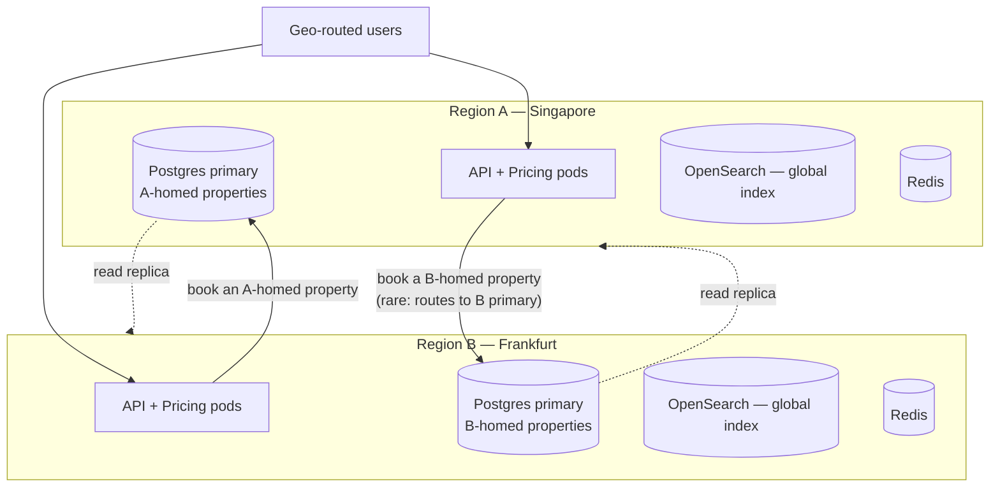

# Booking Platform — Capacity Plan (50k concurrent, two regions)

**Companions:** *System Design* · *Database Design* · *Implementation Plan v2* (Gates G1/G3 validate these numbers)
**Status:** engineering sizing — the node counts are starting points; G1 (booking concurrency) and G3 (search latency) are where these become measured numbers on your real hardware.

---

## 1. Target & Assumptions

| Parameter | Value | Note |
|---|---|---|
| Peak concurrent active users | **50,000** | the headline target |
| Mix | 80% browse (40k) · 15% funnel (7.5k) · 5% booking (2.5k) | a user moves between tiers over a session |
| Regions | **2, active-active**, geo-routed | steady-state ~25k/region; **each region sized for full 50k on failover** (DR posture) |
| Catalog size | 1–5M properties | index is tens of GB — small; QPS, not doc count, drives node count |
| Cache hit rate (price/avail) | ~80% | tunable via Redis TTL (1–5 min) |
| Think times | browse action ~12s · funnel action ~8s · checkout ~5 min | standard web-funnel modeling |

If your real mix or session length differs, the math below is the lever — change the think times and re-derive.

---

## 2. Concurrent Users → Requests/sec (the real currency)

Infrastructure is sized on RPS and tail latency, not on the abstract "user" count. Converting:

**Browse tier (40,000 users, action every ~12s):**
`40,000 / 12 ≈ 3,300 search actions/sec` → ~3,300 OpenSearch QPS, each fanning to a cache-first price-band resolve. With request fan-out ≈ **~5,000 RPS** of dynamic API.

**Funnel tier (7,500 users, action every ~8s):**
`7,500 / 8 ≈ 940 quote checks/sec` → at 80% cache hit, **~190–500 Pricing computes/sec**; ~1,500 RPS of API.

**Booking tier (2,500 users, checkout ~5 min):**
New sessions arrive at `50,000 / 900s ≈ 55/sec`; at ~3–5% conversion → **~2–3 booking commits/sec sustained**, spiking to ~20–30/sec. Holds (including abandonment) ≈ 3–5× → **~10–30 holds/sec peak**.

**Aggregate peak (global):** ≈ **8,000 RPS** dynamic API · **~3,300 OpenSearch QPS** · **~6,000–10,000 Redis ops/sec** · **~10–30 inventory writes/sec**.

The single most important number here: **inventory writes peak at tens/sec.** The Postgres primary ceiling is 2,000–5,000 holds/sec — that's **two orders of magnitude of headroom.** Writes are not the constraint at 50k. The constraints are OpenSearch QPS, API pod count, and — the part that actually requires design thought — the two-region write topology (§4).

---

## 3. Per-Region Sizing (each region sized for full 50k failover)

Instance classes are illustrative (right-size against G1/G3); counts are what matters.

| Tier | Peak load | Run | HPA range | Instance class (illustrative) | HA / notes |
|---|---|---|---|---|---|
| **Gateway (YARP)** | 8,000 RPS | 6–8 pods | 4–16 | 2 vCPU / 4GB | stateless; lightest tier |
| **API / module pods** | 8,000 RPS | 12–16 pods | 8–30 | 4 vCPU / 8GB | stateless; ~800 RPS/pod conservative |
| **OpenSearch** | 3,300 QPS | 5–7 data + 3 master | manual | data: 8 vCPU / 32–64GB | replica shards for read scaling + HA; 1–5M docs ≈ tens of GB |
| **Redis** | 6–10k ops/sec | 3 primary + 3 replica | manual | 4 vCPU / 8–16GB | cluster mode; sessions + price cache + cart locks; trivial load, HA-driven sizing |
| **Pricing pods** | ~500–1k computes/sec | 4–8 pods | 3–16 | 4 vCPU / 8GB | CPU-bound; **first extraction candidate** (Phase 9) |
| **Postgres primary** | ~10–30 writes/sec | 1 (home region) | — | 16 vCPU / 64–128GB | hot ARI partitions (~18mo) stay in RAM; **no sharding needed at this scale** |
| **Postgres read replicas** | cached-miss reads | 2–3 | — | 8 vCPU / 32–64GB | catalog/ARI/history reads |
| **Kafka** | low-thousands msg/sec | 3 brokers | — | 4 vCPU / 16GB | ARI ingest partitioned by property_id |
| **CDN / edge** | media + static pages | managed | — | — | offloads a large fraction of read bytes before it hits origin |

Rough footprint per region: **~30–40 stateless pods + ~8 OpenSearch nodes + ~6 Redis nodes + 3–4 Postgres instances + 3 Kafka brokers.** Two regions ≈ double that for the DR posture.

---

## 4. The Two-Region Decision (the load-bearing part)

You **cannot multi-master the inventory write.** The no-overbooking guarantee (BR-1) requires a *single authority* per room-night — two primaries both decrementing the same night's allotment is exactly the race the whole design exists to prevent. So "two regions" does **not** mean two write masters for the same data.

The clean answer, which also aligns with the existing shard-by-property strategy:

- **Property homing.** Every property is *homed* to one region (geo-aligned — Asian inventory → Singapore, European → Frankfurt). Writes (hold/commit) for a property go **only** to its home region's primary. Single authority per room-night preserved.
- **Reads & search are global.** The OpenSearch index, Redis caches, and Postgres read replicas exist in both regions. A user in Frankfurt browsing a Singapore villa reads locally with no cross-region hop.
- **Cross-region writes are rare and acceptable.** If that Frankfurt user *books* the Singapore villa, the hold routes to Singapore's primary — one cross-region call, +50–150ms. Because holds are tens/sec and browse is thousands/sec, this penalty lands on a tiny fraction of requests. The latency-critical *browse* path is always local.
- **Failover.** Region-internal primary failure → promote a same-region replica (standard HA, RTO seconds–minutes). Whole-region loss → promote the cross-region replica kept for that region's homed properties; accept a brief write-unavailability window for those properties during promotion. Document RPO/RTO per your DR target.

This is why the answer to "how many regions" is not symmetric scaling — it's **single write authority + global reads.**

---

## 5. DR Posture & Cost

Two postures, pick per budget:

- **Active-active, each sized for full 50k** (what §3 sizes): on regional failover the survivor absorbs everything with no scramble. ~2× steady-state cost.
- **Hot-warm:** the secondary runs at ~40% and HPA-bursts on failover. ~1.4× cost, RTO of a few minutes while it scales. Acceptable for most launches.

Recommendation: **hot-warm at launch** (the 50k target has huge write headroom and stateless tiers burst fast), graduate to active-active when revenue justifies the standby cost.

---

## 6. Headroom, Autoscaling & Triggers

- **HPA on the stateless tiers** (gateway, API, Pricing) on CPU + RPS; ranges in §3 give ~2× burst headroom above peak.
- **OpenSearch and Postgres scale manually** (capacity reviews), not reactively — they're stateful.
- **Scale-step triggers** (when to add the next tier *before* you're forced to):
  - API p95 latency > 300ms sustained → add API pods.
  - OpenSearch query p95 > 400ms or CPU > 65% → add a data node / replica shard.
  - Postgres primary CPU > 60% or replica lag > 1s → add a read replica; **only** consider ARI sharding-within-region when a single home region's write rate approaches ~40% of the primary's tested ceiling (far beyond 50k).
  - Redis memory > 60% or evictions rising → grow the cluster.

---

## 7. Scale Roadmap — 50k → 200k → 1M concurrent

| At ~50k | At ~200k | At ~1M |
|---|---|---|
| Monolith pods, Pricing inline | Extract **Search + Pricing** (Phase 9) for independent scaling | Multiple home regions; per-region ARI shard-by-property-hash |
| 1 primary + 2–3 replicas/region | +read replicas; consider read-only edge replicas | Cross-region read fan-out via CDN-cached search |
| OpenSearch 5–7 nodes | 12–20 nodes, region-sharded index | regional indices + a federated query layer |
| Writes trivial (tens/sec) | Writes ~hundreds/sec — still single primary/region | Writes approach ceiling → shard ARI by property hash within region |
| CDN for media/static | CDN for search-result pages too | edge compute for autocomplete + price bands |

The write primary is the *last* thing you shard, and the design already has the seam: bookings are scoped to one property, so property-hash sharding introduces no cross-shard transactions.

---

## 8. Validating These Numbers

The plan is an estimate until the gates measure it on your hardware:

- **G1 (booking concurrency)** — already specified to drive 10k concurrent multi-night holds with the invariant monitor; re-run it sized to your peak hold rate (~30/sec needs nowhere near 10k, but the *hotspot* test — thousands of holds on one scarce room-night — is the real stress and proves the SOLD_OUT path holds at 50k-scale spikes).
- **G3 (search latency)** — search p95 < 500ms, autocomplete p95 < 100ms at your catalog size and 3,300 QPS. This is the test that confirms the OpenSearch node count.
- **Soak test** — run the §2 aggregate (8k RPS, 3.3k QPS, ~20–30 holds/sec) for 4–8 hours and watch for replica lag, cache eviction, and GC pauses. Steady-state stability matters more than peak burst here.

Run these at the §3 sizing; the node counts move only if the gates say so.

---

## 9. Bottom Line

50k concurrent across two regions is **comfortably within this architecture** — the stateless tiers scale horizontally and the inventory write path has two orders of magnitude of headroom. The engineering effort goes into three things, none of them raw capacity: (1) the OpenSearch cluster carrying ~3,300 QPS, (2) the **single-write-authority + global-reads** two-region topology, and (3) keeping the 80% cache hit rate honest so Pricing and Postgres stay quiet. Get those right and the headline number is a provisioning exercise, not an architectural one.
