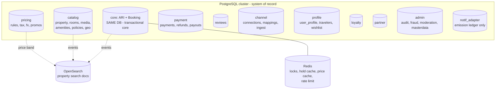
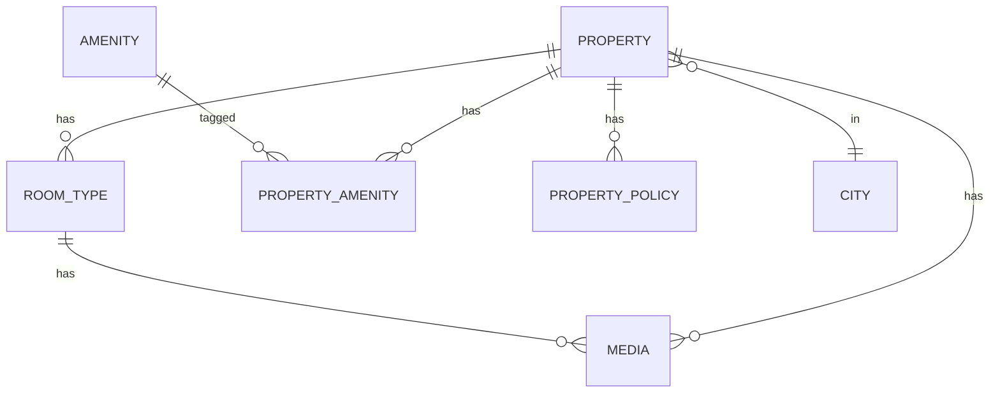
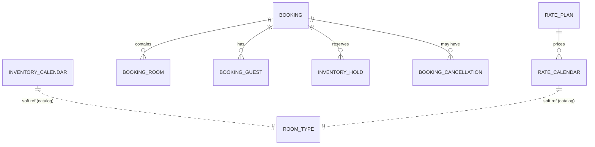

# Booking Platform — Database Design

**Document type:** Data Architecture & Schema Reference
**Companions:** *System Design* doc · *FRD v2* (UC-x, BR-x, INT-x) · *Implementation Plan v2*
**Engines:** PostgreSQL 16 + PostGIS (system of record) · OpenSearch (search read model) · Redis (locks/cache/counters). SQL Server is a viable substitute — substitutions noted in §3.

> **Scope note:** Identity/credentials and notification delivery are **external services**. This design owns only the booking-domain *profile* keyed by the Identity `sub` claim, and a notification *emission ledger* — never passwords, sessions, or message templates.

---

## 1. Strategy & Principles

1. **Database-per-context (logical).** Each bounded context owns its schema with an independent migration history. In the modular-monolith phase these are schemas in one cluster; they lift into separate physical databases unchanged when a context is extracted.
2. **One co-location is mandatory: ARI + Booking share a transactional boundary.** The atomic hold (BR-1, design doc §6.2) updates `inventory_calendar` *and* writes `booking`/`inventory_hold` in **one local transaction**. Splitting them would force a distributed transaction for every hold — unacceptable. They live in the same database. Everything else may be separate.
3. **FKs inside a context, soft references across contexts.** Intra-context relationships use enforced foreign keys. Cross-context references are bare IDs (no FK) reconciled via domain events — this is what makes later physical separation painless.
4. **Polyglot reads.** Postgres is truth; OpenSearch and Redis are derived, disposable, rebuildable read models. Booking never reads availability from them (BR-1).
5. **Append-only where money or audit is involved.** Payments, refunds, payouts, loyalty ledger, and audit log are immutable event records, not mutable state.
6. **Optimistic concurrency by default** (`row_version`), pessimistic/conditional only on the inventory hot path.

---

## 2. Logical Database Map



**Ownership ↔ context ↔ use-case modules**

| DB / schema | Bounded context | UC modules |
|---|---|---|
| `catalog` | Catalog | M6 (listing), M1.5 |
| `core` (ARI **+** Booking) | ARI + Booking | M2, M4, M6.7–6.10, M1.6 |
| `pricing` | Pricing & Promotions | M8 |
| `payment` | Payment | M3 |
| `reviews` | Reviews | M9 |
| `channel` | Channel/PMS | M7 |
| `profile` | Account (booking-side) | M5 (platform parts), M1.7 |
| `loyalty` | Loyalty | M11 |
| `partner` | Partner API | M13 |
| `admin` | Admin/Ops + master data | M12, M14 source events |
| `notif_adapter` | Notification triggers | M10 |
| OpenSearch | Search read model | M1 |
| Redis | Locks/cache | M2 (holds), M1 (cache), M13 (rate limit) |

---

## 3. Conventions

- **Keys:** `BIGINT GENERATED ALWAYS AS IDENTITY` surrogate PKs; natural keys get unique constraints. Public-facing identifiers (booking reference, partner key) are separate, non-sequential, checksummed.
- **Concurrency:** every host/guest-editable row carries `row_version INTEGER` (maps to EF Core concurrency token). *SQL Server: `rowversion`/`timestamp`.*
- **Money:** `NUMERIC(12,2)` + explicit `CHAR(3)` ISO currency on the same row — never a bare amount. FX rate stored where conversion happens.
- **Time:** all timestamps `TIMESTAMPTZ` (UTC). Stay dates are `DATE`. Policy/cutoff math uses the property's IANA timezone string (BR-4), never the server's.
- **Soft delete:** `is_deleted BOOLEAN` + `deleted_at` only where history matters (listings); hard delete elsewhere. Financial/audit rows are never deleted.
- **Geo:** `GEOGRAPHY(POINT,4326)` + GIST index. *SQL Server: `geography` type.*
- **Audit columns:** `created_at`, `updated_at` everywhere; `created_by`/`updated_by` (`sub`) on host/ops-editable rows.
- **Cross-context FK:** absent by design; the column comments note the owning context.

---

## 4. Catalog Schema (`catalog`)



```sql
CREATE SCHEMA catalog;

-- master data (also surfaced via admin UC-12.6)
CREATE TABLE catalog.city (
    id           BIGINT GENERATED ALWAYS AS IDENTITY PRIMARY KEY,
    name         TEXT NOT NULL,
    country_code CHAR(2) NOT NULL,
    region       TEXT,
    geo          GEOGRAPHY(POINT,4326) NOT NULL,
    timezone     TEXT NOT NULL,                    -- default IANA tz for the city
    UNIQUE (name, country_code, region)
);
CREATE INDEX idx_city_geo ON catalog.city USING GIST (geo);

CREATE TABLE catalog.amenity (
    id       BIGINT GENERATED ALWAYS AS IDENTITY PRIMARY KEY,
    code     TEXT UNIQUE NOT NULL,                 -- WIFI, POOL, PARKING...
    category TEXT NOT NULL,                        -- CONNECTIVITY, FACILITY...
    label    TEXT NOT NULL
);

CREATE TABLE catalog.property (
    id               BIGINT GENERATED ALWAYS AS IDENTITY PRIMARY KEY,
    host_id          TEXT NOT NULL,                -- Identity sub (profile context)
    name             TEXT NOT NULL,
    property_type    TEXT NOT NULL,                -- HOTEL|VILLA|APARTMENT|HOMESTAY|RESORT
    description      TEXT,
    star_rating      SMALLINT CHECK (star_rating BETWEEN 1 AND 5),
    status           TEXT NOT NULL DEFAULT 'DRAFT',-- DRAFT|IN_REVIEW|LIVE|SUSPENDED
    geo              GEOGRAPHY(POINT,4326) NOT NULL,
    city_id          BIGINT NOT NULL REFERENCES catalog.city(id),
    country_code     CHAR(2) NOT NULL,
    address          JSONB NOT NULL,
    default_currency CHAR(3) NOT NULL,
    timezone         TEXT NOT NULL,                -- IANA, overrides city default
    check_in_time    TIME, check_out_time TIME,
    is_deleted       BOOLEAN NOT NULL DEFAULT false,
    created_at       TIMESTAMPTZ NOT NULL DEFAULT now(),
    updated_at       TIMESTAMPTZ NOT NULL DEFAULT now(),
    row_version      INTEGER NOT NULL DEFAULT 0
);
CREATE INDEX idx_property_geo  ON catalog.property USING GIST (geo);
CREATE INDEX idx_property_city ON catalog.property (city_id) WHERE status='LIVE';
CREATE INDEX idx_property_host ON catalog.property (host_id);

CREATE TABLE catalog.room_type (
    id             BIGINT GENERATED ALWAYS AS IDENTITY PRIMARY KEY,
    property_id    BIGINT NOT NULL REFERENCES catalog.property(id),
    name           TEXT NOT NULL,
    unit_kind      TEXT NOT NULL,                  -- ROOM | ENTIRE_UNIT (villa)
    total_units    INT NOT NULL CHECK (total_units > 0),
    base_occupancy SMALLINT NOT NULL,
    max_occupancy  SMALLINT NOT NULL,
    max_adults     SMALLINT, max_children SMALLINT,
    bed_config     JSONB,
    size_sqm       NUMERIC(6,1),
    row_version    INTEGER NOT NULL DEFAULT 0
);
CREATE INDEX idx_roomtype_property ON catalog.room_type (property_id);

CREATE TABLE catalog.property_amenity (
    property_id BIGINT NOT NULL REFERENCES catalog.property(id),
    amenity_id  BIGINT NOT NULL REFERENCES catalog.amenity(id),
    PRIMARY KEY (property_id, amenity_id)
);

CREATE TABLE catalog.media (
    id           BIGINT GENERATED ALWAYS AS IDENTITY PRIMARY KEY,
    property_id  BIGINT REFERENCES catalog.property(id),
    room_type_id BIGINT REFERENCES catalog.room_type(id),
    storage_key  TEXT NOT NULL,                    -- object-store key, not the blob
    kind         TEXT NOT NULL,                    -- IMAGE|VIDEO|360
    sort_order   INT NOT NULL DEFAULT 0,
    is_primary   BOOLEAN NOT NULL DEFAULT false,
    moderation   TEXT NOT NULL DEFAULT 'PENDING'   -- PENDING|APPROVED|REJECTED
);

CREATE TABLE catalog.property_policy (
    id             BIGINT GENERATED ALWAYS AS IDENTITY PRIMARY KEY,
    property_id    BIGINT NOT NULL REFERENCES catalog.property(id),
    house_rules    JSONB,
    child_policy   JSONB,
    pet_policy     JSONB,
    row_version    INTEGER NOT NULL DEFAULT 0
);
```

Cancellation policies are referenced by rate plans, which sit in `core` (rate plans drive the hold). The policy *definition* is catalog-owned but copied/snapshotted onto bookings at hold time so a later policy edit never changes an existing booking (BR-2):

```sql
CREATE TABLE catalog.cancellation_policy (
    id           BIGINT GENERATED ALWAYS AS IDENTITY PRIMARY KEY,
    property_id  BIGINT NOT NULL REFERENCES catalog.property(id),
    name         TEXT NOT NULL,                    -- "Flexible","Non-refundable"
    is_refundable BOOLEAN NOT NULL,
    tiers        JSONB NOT NULL,                   -- [{hours_before:48,refund_pct:100},...]
    row_version  INTEGER NOT NULL DEFAULT 0
);
```

---

## 5. Core Schema — ARI + Booking (`core`) — the transactional heart

This single database guarantees BR-1. The hold transaction touches `inventory_calendar` and `booking`/`inventory_hold` together.



```sql
CREATE SCHEMA core;

-- rate plan (soft-refs catalog.room_type & catalog.cancellation_policy)
CREATE TABLE core.rate_plan (
    id                     BIGINT GENERATED ALWAYS AS IDENTITY PRIMARY KEY,
    property_id            BIGINT NOT NULL,         -- soft ref catalog
    room_type_id           BIGINT NOT NULL,         -- soft ref catalog
    name                   TEXT NOT NULL,
    meal_plan              TEXT,                     -- ROOM_ONLY|BREAKFAST|HALF_BOARD|FULL_BOARD
    cancellation_policy_id BIGINT NOT NULL,         -- soft ref catalog
    is_refundable          BOOLEAN NOT NULL,
    is_active              BOOLEAN NOT NULL DEFAULT true,
    row_version            INTEGER NOT NULL DEFAULT 0
);
CREATE INDEX idx_rateplan_roomtype ON core.rate_plan (room_type_id);

-- ===== INVENTORY (hot, partitioned by month on stay_date) =====
CREATE TABLE core.inventory_calendar (
    room_type_id         BIGINT  NOT NULL,          -- soft ref catalog
    stay_date            DATE    NOT NULL,
    total_allotment      INT     NOT NULL CHECK (total_allotment >= 0),
    units_sold           INT     NOT NULL DEFAULT 0 CHECK (units_sold >= 0),
    units_held           INT     NOT NULL DEFAULT 0 CHECK (units_held >= 0),
    stop_sell            BOOLEAN NOT NULL DEFAULT false,
    min_los              SMALLINT,
    max_los              SMALLINT,
    closed_to_arrival    BOOLEAN NOT NULL DEFAULT false,
    closed_to_departure  BOOLEAN NOT NULL DEFAULT false,
    row_version          INTEGER NOT NULL DEFAULT 0,
    PRIMARY KEY (room_type_id, stay_date),
    CONSTRAINT chk_no_oversell CHECK (units_sold + units_held <= total_allotment)
) PARTITION BY RANGE (stay_date);
-- available(night) = total_allotment - units_sold - units_held
-- The CHECK constraint is a last-line DB-level guard behind the app logic (BR-1).

-- ===== RATES (partitioned identically) =====
CREATE TABLE core.rate_calendar (
    room_type_id     BIGINT NOT NULL,               -- soft ref catalog
    rate_plan_id     BIGINT NOT NULL REFERENCES core.rate_plan(id),
    stay_date        DATE   NOT NULL,
    base_price       NUMERIC(12,2) NOT NULL,
    currency         CHAR(3) NOT NULL,
    occupancy_prices JSONB,                          -- {"1":-20.00,"3":15.00}
    PRIMARY KEY (room_type_id, rate_plan_id, stay_date)
) PARTITION BY RANGE (stay_date);

-- example monthly partitions (a scheduled job pre-creates ~18 months ahead)
CREATE TABLE core.inventory_calendar_2026_06 PARTITION OF core.inventory_calendar
    FOR VALUES FROM ('2026-06-01') TO ('2026-07-01');
CREATE TABLE core.rate_calendar_2026_06 PARTITION OF core.rate_calendar
    FOR VALUES FROM ('2026-06-01') TO ('2026-07-01');

-- ===== BOOKING =====
CREATE TABLE core.booking (
    id              BIGINT GENERATED ALWAYS AS IDENTITY PRIMARY KEY,
    reference       TEXT UNIQUE NOT NULL,           -- public, non-sequential, checksummed
    user_id         BIGINT,                          -- soft ref profile; NULL = guest checkout
    contact_email   TEXT NOT NULL,                   -- always present (guest or registered)
    property_id     BIGINT NOT NULL,                 -- soft ref catalog
    status          TEXT NOT NULL,                   -- DRAFT|HELD|CONFIRMED|CANCELLED|NO_SHOW|COMPLETED|EXPIRED|FAILED
    currency        CHAR(3) NOT NULL,
    total_amount    NUMERIC(12,2) NOT NULL,
    tax_amount      NUMERIC(12,2) NOT NULL,
    fx_rate_used    NUMERIC(18,8),                   -- snapshot when display≠settlement ccy
    cancellation_snapshot JSONB,                     -- frozen policy at hold (BR-2)
    hold_expires_at TIMESTAMPTZ,                      -- set while HELD (BR-3)
    created_at      TIMESTAMPTZ NOT NULL DEFAULT now(),
    updated_at      TIMESTAMPTZ NOT NULL DEFAULT now(),
    row_version     INTEGER NOT NULL DEFAULT 0
);
CREATE INDEX idx_booking_user   ON core.booking (user_id) WHERE user_id IS NOT NULL;
CREATE INDEX idx_booking_email  ON core.booking (contact_email);
CREATE INDEX idx_booking_status ON core.booking (status);
CREATE INDEX idx_booking_held   ON core.booking (hold_expires_at) WHERE status='HELD';

CREATE TABLE core.booking_room (
    id                BIGINT GENERATED ALWAYS AS IDENTITY PRIMARY KEY,
    booking_id        BIGINT NOT NULL REFERENCES core.booking(id),
    room_type_id      BIGINT NOT NULL,               -- soft ref catalog
    rate_plan_id      BIGINT NOT NULL REFERENCES core.rate_plan(id),
    check_in          DATE NOT NULL,
    check_out         DATE NOT NULL,                 -- [check_in, check_out) nights
    quantity          INT  NOT NULL CHECK (quantity > 0),
    adults SMALLINT, children SMALLINT,
    nightly_breakdown JSONB NOT NULL,                -- frozen per-night price (BR-2)
    subtotal          NUMERIC(12,2) NOT NULL,
    CHECK (check_out > check_in)
);
CREATE INDEX idx_bookingroom_booking ON core.booking_room (booking_id);

CREATE TABLE core.booking_guest (
    id         BIGINT GENERATED ALWAYS AS IDENTITY PRIMARY KEY,
    booking_id BIGINT NOT NULL REFERENCES core.booking(id),
    full_name  TEXT, is_lead BOOLEAN NOT NULL DEFAULT false
);

-- transient holds for the reaper + audit (counters live on inventory_calendar)
CREATE TABLE core.inventory_hold (
    id           UUID PRIMARY KEY,
    booking_id   BIGINT NOT NULL REFERENCES core.booking(id),
    room_type_id BIGINT NOT NULL,
    stay_date    DATE NOT NULL,
    quantity     INT NOT NULL,
    expires_at   TIMESTAMPTZ NOT NULL,
    released     BOOLEAN NOT NULL DEFAULT false
);
CREATE INDEX idx_hold_expiry ON core.inventory_hold (expires_at) WHERE released=false;

CREATE TABLE core.booking_cancellation (
    id            BIGINT GENERATED ALWAYS AS IDENTITY PRIMARY KEY,
    booking_id    BIGINT NOT NULL REFERENCES core.booking(id),
    cancelled_by  TEXT NOT NULL,                     -- sub or 'OPS'/'HOST'
    reason        TEXT,
    refund_amount NUMERIC(12,2) NOT NULL,
    refund_pct    NUMERIC(5,2) NOT NULL,
    created_at    TIMESTAMPTZ NOT NULL DEFAULT now()
);

-- transactional outbox (reliable eventing, no dual-write) — BR-5/BR-11
CREATE TABLE core.outbox_message (
    id           UUID PRIMARY KEY,
    aggregate    TEXT NOT NULL,
    type         TEXT NOT NULL,
    payload      JSONB NOT NULL,
    occurred_at  TIMESTAMPTZ NOT NULL DEFAULT now(),
    processed_at TIMESTAMPTZ
);
CREATE INDEX idx_outbox_unprocessed ON core.outbox_message (occurred_at)
    WHERE processed_at IS NULL;

-- saga state (if using persisted orchestration rather than the lib's store)
CREATE TABLE core.booking_saga (
    booking_id   BIGINT PRIMARY KEY REFERENCES core.booking(id),
    state        TEXT NOT NULL,
    payload      JSONB NOT NULL,
    updated_at   TIMESTAMPTZ NOT NULL DEFAULT now()
);
```

**The atomic multi-night hold** (the statement BR-1 hangs on — design doc §6.2):
```sql
WITH held AS (
  UPDATE core.inventory_calendar
     SET units_held = units_held + :qty, row_version = row_version + 1
   WHERE room_type_id = :roomTypeId
     AND stay_date >= :checkIn AND stay_date < :checkOut
     AND stop_sell = false
     AND (total_allotment - units_sold - units_held) >= :qty
  RETURNING stay_date)
SELECT count(*) FROM held;   -- must equal nights; else ROLLBACK (all-or-nothing)
```

---

## 6. Pricing & Promotions (`pricing`)

```sql
CREATE SCHEMA pricing;

CREATE TABLE pricing.pricing_rule (
    id         BIGINT GENERATED ALWAYS AS IDENTITY PRIMARY KEY,
    scope_type TEXT NOT NULL,        -- PROPERTY|ROOM_TYPE|RATE_PLAN
    scope_id   BIGINT NOT NULL,
    rule_type  TEXT NOT NULL,        -- LOS_DISCOUNT|EARLY_BIRD|SEASONAL|OCCUPANCY
    priority   INT NOT NULL,
    conditions JSONB NOT NULL,       -- {"min_nights":7}
    effect     JSONB NOT NULL,       -- {"discount_pct":10}
    valid_from DATE, valid_to DATE,
    is_active  BOOLEAN NOT NULL DEFAULT true
);
CREATE INDEX idx_pricingrule_scope ON pricing.pricing_rule (scope_type, scope_id) WHERE is_active;

CREATE TABLE pricing.tax_rule (
    id           BIGINT GENERATED ALWAYS AS IDENTITY PRIMARY KEY,
    country_code CHAR(2) NOT NULL,
    city_id      BIGINT,                            -- soft ref catalog; NULL = countrywide
    tax_type     TEXT NOT NULL,                     -- VAT|GST|CITY_TAX|SERVICE_FEE
    calc         JSONB NOT NULL,                    -- {"mode":"pct","value":7} | {"mode":"per_night","value":2.00}
    valid_from   DATE, valid_to DATE
);
CREATE INDEX idx_taxrule_juris ON pricing.tax_rule (country_code, city_id);

CREATE TABLE pricing.fx_rate (
    base_ccy   CHAR(3) NOT NULL,
    quote_ccy  CHAR(3) NOT NULL,
    rate       NUMERIC(18,8) NOT NULL,
    as_of      TIMESTAMPTZ NOT NULL,
    PRIMARY KEY (base_ccy, quote_ccy, as_of)
);

CREATE TABLE pricing.promotion (
    id          BIGINT GENERATED ALWAYS AS IDENTITY PRIMARY KEY,
    owner_type  TEXT NOT NULL,        -- PLATFORM|HOST
    owner_id    TEXT,                 -- host sub when HOST
    name        TEXT NOT NULL,
    promo_type  TEXT NOT NULL,        -- EARLY_BIRD|LAST_MINUTE|LOS|FLAT|PERCENT
    rules       JSONB NOT NULL,
    valid_from  DATE, valid_to DATE,
    is_active   BOOLEAN NOT NULL DEFAULT true
);

CREATE TABLE pricing.coupon (
    id            BIGINT GENERATED ALWAYS AS IDENTITY PRIMARY KEY,
    code          TEXT UNIQUE NOT NULL,
    promotion_id  BIGINT NOT NULL REFERENCES pricing.promotion(id),
    max_redemptions INT,
    per_user_limit  INT,
    redeemed_count  INT NOT NULL DEFAULT 0,
    stackable       BOOLEAN NOT NULL DEFAULT false
);

CREATE TABLE pricing.coupon_redemption (
    id         BIGINT GENERATED ALWAYS AS IDENTITY PRIMARY KEY,
    coupon_id  BIGINT NOT NULL REFERENCES pricing.coupon(id),
    user_id    BIGINT,                              -- soft ref profile
    booking_id BIGINT NOT NULL,                     -- soft ref core
    redeemed_at TIMESTAMPTZ NOT NULL DEFAULT now(),
    UNIQUE (coupon_id, booking_id)
);
```

---

## 7. Payment (`payment`) — append-only money records

```mermaid
erDiagram
    PAYMENT ||--o{ REFUND : "refunded by"
    PAYOUT ||--o{ PAYOUT_ITEM : aggregates
    PAYOUT }o--|| PAYOUT_ACCOUNT : to
    PAYMENT ||--o{ DISPUTE : "may have"
```

```sql
CREATE SCHEMA payment;

CREATE TABLE payment.payment (
    id              BIGINT GENERATED ALWAYS AS IDENTITY PRIMARY KEY,
    booking_id      BIGINT NOT NULL,                 -- soft ref core
    psp             TEXT NOT NULL,                    -- STRIPE|ADYEN|RAZORPAY
    psp_ref         TEXT, intent_id TEXT,
    amount          NUMERIC(12,2) NOT NULL,
    currency        CHAR(3) NOT NULL,
    status          TEXT NOT NULL,                    -- AUTHORIZED|CAPTURED|FAILED|REFUNDED|VOIDED
    idempotency_key TEXT UNIQUE NOT NULL,             -- booking_id+attempt (BR-5)
    method_kind     TEXT,                             -- CARD|WALLET|BANK
    created_at      TIMESTAMPTZ NOT NULL DEFAULT now()
);
CREATE INDEX idx_payment_booking ON payment.payment (booking_id);

CREATE TABLE payment.refund (
    id          BIGINT GENERATED ALWAYS AS IDENTITY PRIMARY KEY,
    payment_id  BIGINT NOT NULL REFERENCES payment.payment(id),
    amount      NUMERIC(12,2) NOT NULL,
    currency    CHAR(3) NOT NULL,
    reason      TEXT,
    status      TEXT NOT NULL,                        -- PENDING|SUCCEEDED|FAILED
    psp_ref     TEXT,
    idempotency_key TEXT UNIQUE NOT NULL,
    created_at  TIMESTAMPTZ NOT NULL DEFAULT now()
);

CREATE TABLE payment.psp_webhook_event (   -- idempotent webhook ingest
    psp_event_id TEXT PRIMARY KEY,
    psp          TEXT NOT NULL,
    type         TEXT NOT NULL,
    payload      JSONB NOT NULL,
    received_at  TIMESTAMPTZ NOT NULL DEFAULT now(),
    processed_at TIMESTAMPTZ
);

-- host settlement (UC-3.10, UC-6.12)
CREATE TABLE payment.payout_account (
    id        BIGINT GENERATED ALWAYS AS IDENTITY PRIMARY KEY,
    host_id   TEXT NOT NULL,                          -- soft ref profile (Identity sub)
    psp_account_ref TEXT NOT NULL,                    -- tokenized at payout provider
    currency  CHAR(3) NOT NULL,
    status    TEXT NOT NULL DEFAULT 'PENDING'
);

CREATE TABLE payment.payout (
    id          BIGINT GENERATED ALWAYS AS IDENTITY PRIMARY KEY,
    payout_account_id BIGINT NOT NULL REFERENCES payment.payout_account(id),
    period_start DATE NOT NULL, period_end DATE NOT NULL,
    gross_amount NUMERIC(12,2) NOT NULL,
    commission   NUMERIC(12,2) NOT NULL,
    net_amount   NUMERIC(12,2) NOT NULL,
    currency     CHAR(3) NOT NULL,
    status       TEXT NOT NULL,                        -- DRAFT|SCHEDULED|PAID|FAILED
    paid_at      TIMESTAMPTZ
);
CREATE TABLE payment.payout_item (
    id         BIGINT GENERATED ALWAYS AS IDENTITY PRIMARY KEY,
    payout_id  BIGINT NOT NULL REFERENCES payment.payout(id),
    booking_id BIGINT NOT NULL,                        -- soft ref core
    amount     NUMERIC(12,2) NOT NULL,
    commission NUMERIC(12,2) NOT NULL
);

CREATE TABLE payment.dispute (                          -- UC-12.3 chargebacks
    id          BIGINT GENERATED ALWAYS AS IDENTITY PRIMARY KEY,
    payment_id  BIGINT NOT NULL REFERENCES payment.payment(id),
    psp_ref     TEXT, status TEXT NOT NULL,
    amount      NUMERIC(12,2) NOT NULL,
    evidence    JSONB, opened_at TIMESTAMPTZ NOT NULL DEFAULT now(),
    resolved_at TIMESTAMPTZ
);
```

---

## 8. Profile (`profile`) — booking-side account (integrates Identity)

No credentials, no passwords — keyed by Identity `sub`. Local surrogate `id` for clean internal FKs.

```sql
CREATE SCHEMA profile;

CREATE TABLE profile.user_profile (
    id                 BIGINT GENERATED ALWAYS AS IDENTITY PRIMARY KEY,
    external_subject   TEXT UNIQUE NOT NULL,          -- Identity 'sub' (UC-5.1a, INT-I3)
    display_name       TEXT,                          -- cached from claims (BR-10)
    email              TEXT,                          -- cached, refreshed on login
    locale             TEXT,
    preferred_currency CHAR(3),
    email_verified     BOOLEAN NOT NULL DEFAULT false,
    created_at         TIMESTAMPTZ NOT NULL DEFAULT now(),
    row_version        INTEGER NOT NULL DEFAULT 0
);

-- platform role mapping (UC-12.1, INT-I4) — grantable without Identity changes
CREATE TABLE profile.user_role (
    user_id    BIGINT NOT NULL REFERENCES profile.user_profile(id),
    role       TEXT NOT NULL,                          -- guest|host|ops|moderator|finance|partner
    granted_by TEXT, granted_at TIMESTAMPTZ NOT NULL DEFAULT now(),
    PRIMARY KEY (user_id, role)
);

-- host KYC state (platform-owned per OQ-1 recommendation)
CREATE TABLE profile.host_profile (
    user_id      BIGINT PRIMARY KEY REFERENCES profile.user_profile(id),
    legal_name   TEXT, tax_id TEXT,
    kyc_status   TEXT NOT NULL DEFAULT 'PENDING',      -- PENDING|VERIFIED|REJECTED
    kyc_provider_ref TEXT,
    onboarded_at TIMESTAMPTZ,
    row_version  INTEGER NOT NULL DEFAULT 0
);

CREATE TABLE profile.saved_traveler (                   -- UC-5.4
    id         BIGINT GENERATED ALWAYS AS IDENTITY PRIMARY KEY,
    user_id    BIGINT NOT NULL REFERENCES profile.user_profile(id),
    full_name  TEXT NOT NULL, dob DATE, doc_type TEXT, doc_number TEXT
);

CREATE TABLE profile.wishlist (                         -- UC-1.7
    user_id     BIGINT NOT NULL REFERENCES profile.user_profile(id),
    property_id BIGINT NOT NULL,                        -- soft ref catalog
    added_at    TIMESTAMPTZ NOT NULL DEFAULT now(),
    PRIMARY KEY (user_id, property_id)
);

-- saved payment methods = PSP tokens only, never PAN (UC-3.9, SAQ-A)
CREATE TABLE profile.payment_method_token (
    id        BIGINT GENERATED ALWAYS AS IDENTITY PRIMARY KEY,
    user_id   BIGINT NOT NULL REFERENCES profile.user_profile(id),
    psp       TEXT NOT NULL, psp_token TEXT NOT NULL,
    brand TEXT, last4 CHAR(4), exp_month SMALLINT, exp_year SMALLINT,
    is_default BOOLEAN NOT NULL DEFAULT false
);

-- booking-category notification preferences (only if INT-N3 = platform-owned)
CREATE TABLE profile.notification_preference (
    user_id  BIGINT NOT NULL REFERENCES profile.user_profile(id),
    category TEXT NOT NULL,
    opted_in BOOLEAN NOT NULL DEFAULT true,
    PRIMARY KEY (user_id, category)
);
```

---

## 9. Reviews (`reviews`)

```sql
CREATE SCHEMA reviews;

CREATE TABLE reviews.review (
    id           BIGINT GENERATED ALWAYS AS IDENTITY PRIMARY KEY,
    booking_id   BIGINT NOT NULL UNIQUE,              -- soft ref core; verified stay (BR-6)
    property_id  BIGINT NOT NULL,                     -- soft ref catalog
    user_id      BIGINT NOT NULL,                     -- soft ref profile
    overall      SMALLINT NOT NULL CHECK (overall BETWEEN 1 AND 10),
    subscores    JSONB,                               -- {"cleanliness":9,"location":8}
    comment      TEXT,
    status       TEXT NOT NULL DEFAULT 'PENDING',     -- PENDING|PUBLISHED|REJECTED
    created_at   TIMESTAMPTZ NOT NULL DEFAULT now()
);
CREATE INDEX idx_review_property ON reviews.review (property_id) WHERE status='PUBLISHED';

CREATE TABLE reviews.review_response (
    id        BIGINT GENERATED ALWAYS AS IDENTITY PRIMARY KEY,
    review_id BIGINT NOT NULL UNIQUE REFERENCES reviews.review(id),
    host_id   TEXT NOT NULL, body TEXT NOT NULL,
    created_at TIMESTAMPTZ NOT NULL DEFAULT now()
);

CREATE TABLE reviews.review_flag (
    id        BIGINT GENERATED ALWAYS AS IDENTITY PRIMARY KEY,
    review_id BIGINT NOT NULL REFERENCES reviews.review(id),
    flagged_by TEXT NOT NULL, reason TEXT,
    created_at TIMESTAMPTZ NOT NULL DEFAULT now()
);

-- materialized aggregate, refreshed on review publish (feeds search ranking)
CREATE TABLE reviews.rating_aggregate (
    property_id  BIGINT PRIMARY KEY,                  -- soft ref catalog
    review_count INT NOT NULL DEFAULT 0,
    avg_overall  NUMERIC(4,2) NOT NULL DEFAULT 0,
    subscore_avgs JSONB,
    updated_at   TIMESTAMPTZ NOT NULL DEFAULT now()
);
```

---

## 10. Channel / PMS (`channel`)

```sql
CREATE SCHEMA channel;

CREATE TABLE channel.connection (
    id            BIGINT GENERATED ALWAYS AS IDENTITY PRIMARY KEY,
    property_id   BIGINT NOT NULL,                    -- soft ref catalog
    provider      TEXT NOT NULL,                      -- SITEMINDER|STAAH|...
    credentials_ref TEXT NOT NULL,                    -- secret store ref, not the secret
    status        TEXT NOT NULL DEFAULT 'PENDING',
    last_sync_at  TIMESTAMPTZ
);

CREATE TABLE channel.room_mapping (                    -- UC-7.6
    id            BIGINT GENERATED ALWAYS AS IDENTITY PRIMARY KEY,
    connection_id BIGINT NOT NULL REFERENCES channel.connection(id),
    external_room_code TEXT NOT NULL,
    room_type_id  BIGINT NOT NULL,                    -- soft ref catalog
    rate_plan_id  BIGINT,                             -- soft ref core
    UNIQUE (connection_id, external_room_code)
);

-- per-property ordered ingest tracking (UC-7.2; ordering = Kafka key, this is the dedupe ledger)
CREATE TABLE channel.ari_ingest_log (
    id            BIGINT GENERATED ALWAYS AS IDENTITY PRIMARY KEY,
    connection_id BIGINT NOT NULL REFERENCES channel.connection(id),
    sequence_no   BIGINT NOT NULL,                    -- provider sequence/version
    payload       JSONB NOT NULL,
    applied       BOOLEAN NOT NULL DEFAULT false,
    received_at   TIMESTAMPTZ NOT NULL DEFAULT now(),
    UNIQUE (connection_id, sequence_no)               -- drop stale/dupes (BR-5)
);

CREATE TABLE channel.booking_sync (                    -- reverse sync UC-7.3
    id           BIGINT GENERATED ALWAYS AS IDENTITY PRIMARY KEY,
    booking_id   BIGINT NOT NULL,                     -- soft ref core
    connection_id BIGINT NOT NULL REFERENCES channel.connection(id),
    direction    TEXT NOT NULL,                       -- OUTBOUND
    status       TEXT NOT NULL,                       -- PENDING|SENT|FAILED
    attempts     INT NOT NULL DEFAULT 0,
    synced_at    TIMESTAMPTZ
);
```

---

## 11. Loyalty (`loyalty`) — append-only ledger

```sql
CREATE SCHEMA loyalty;

CREATE TABLE loyalty.account (
    user_id      BIGINT PRIMARY KEY,                  -- soft ref profile
    balance      INT NOT NULL DEFAULT 0,
    tier         TEXT NOT NULL DEFAULT 'BASE',
    tier_valid_to DATE,
    row_version  INTEGER NOT NULL DEFAULT 0
);

CREATE TABLE loyalty.ledger (                           -- immutable
    id         BIGINT GENERATED ALWAYS AS IDENTITY PRIMARY KEY,
    user_id    BIGINT NOT NULL,
    delta      INT NOT NULL,                            -- + earn, - redeem
    reason     TEXT NOT NULL,                           -- EARN_STAY|REDEEM|EXPIRE|ADJUST
    booking_id BIGINT,                                  -- soft ref core
    created_at TIMESTAMPTZ NOT NULL DEFAULT now()
);
```

---

## 12. Partner API (`partner`)

```sql
CREATE SCHEMA partner;

CREATE TABLE partner.partner (
    id          BIGINT GENERATED ALWAYS AS IDENTITY PRIMARY KEY,
    name        TEXT NOT NULL,
    client_id   TEXT NOT NULL,                         -- Identity client-credentials (INT-I6)
    status      TEXT NOT NULL DEFAULT 'ACTIVE',
    rate_limit_rpm INT NOT NULL DEFAULT 600
);

CREATE TABLE partner.commission_rule (                  -- UC-13.4
    id         BIGINT GENERATED ALWAYS AS IDENTITY PRIMARY KEY,
    partner_id BIGINT NOT NULL REFERENCES partner.partner(id),
    scope      JSONB,                                  -- markets/property types
    markup     JSONB NOT NULL,                         -- {"mode":"pct","value":8}
    valid_from DATE, valid_to DATE
);
```

---

## 13. Admin / Ops & Master Data (`admin`)

```sql
CREATE SCHEMA admin;

CREATE TABLE admin.audit_log (                          -- immutable (UC-12.7, BR-7)
    id          BIGINT GENERATED ALWAYS AS IDENTITY PRIMARY KEY,
    actor       TEXT NOT NULL,                          -- sub
    action      TEXT NOT NULL,
    entity_type TEXT NOT NULL, entity_id TEXT NOT NULL,
    before      JSONB, after JSONB,
    reason      TEXT,                                   -- mandatory on overrides
    created_at  TIMESTAMPTZ NOT NULL DEFAULT now()
);
CREATE INDEX idx_audit_entity ON admin.audit_log (entity_type, entity_id);

CREATE TABLE admin.moderation_queue (                   -- UC-12.2
    id          BIGINT GENERATED ALWAYS AS IDENTITY PRIMARY KEY,
    target_type TEXT NOT NULL,                          -- PROPERTY|MEDIA|REVIEW
    target_id   BIGINT NOT NULL,
    status      TEXT NOT NULL DEFAULT 'PENDING',
    assigned_to TEXT, decided_by TEXT, decided_at TIMESTAMPTZ
);

CREATE TABLE admin.fraud_rule (                         -- UC-12.5
    id         BIGINT GENERATED ALWAYS AS IDENTITY PRIMARY KEY,
    rule_type  TEXT NOT NULL,                           -- VELOCITY|GEO|AMOUNT|DEVICE
    config     JSONB NOT NULL, is_active BOOLEAN NOT NULL DEFAULT true
);

CREATE TABLE admin.block_list (
    id         BIGINT GENERATED ALWAYS AS IDENTITY PRIMARY KEY,
    kind       TEXT NOT NULL,                           -- EMAIL|IP|CARD_FINGERPRINT|USER
    value      TEXT NOT NULL, reason TEXT,
    created_at TIMESTAMPTZ NOT NULL DEFAULT now(),
    UNIQUE (kind, value)
);
```

Reporting/analytics (M14) is **not** transactional tables — funnel/booking events stream to an analytics topic → warehouse (e.g. ClickHouse/BigQuery). Operational dashboards read the warehouse, not these OLTP stores.

---

## 14. Notification Adapter (`notif_adapter`) — emission ledger only

The Notification Service owns delivery, templates, channels, retries. This platform records only what it *emitted* (BR-11, INT-N1).

```sql
CREATE SCHEMA notif_adapter;

CREATE TABLE notif_adapter.emission_ledger (
    event_id    TEXT PRIMARY KEY,                      -- e.g. BookingConfirmed:{booking_id} (BR-5 dedupe)
    category    TEXT NOT NULL,                          -- booking_confirmed|host_new_booking|...
    recipient   TEXT NOT NULL,                          -- sub OR raw contact (guest checkout, OQ-3)
    locale      TEXT,
    payload     JSONB NOT NULL,
    emitted_at  TIMESTAMPTZ NOT NULL DEFAULT now(),
    delivery_status TEXT                                -- if INT-N4 feedback available
);
```

---

## 15. Redis — Keyspace Design (non-relational)

| Purpose | Key pattern | Type / TTL | Notes |
|---|---|---|---|
| Per-cart hold serialization | `lock:cart:{cartId}` | SET NX PX, ~30 s | Prevents double-submit; **not** inventory truth |
| Price+avail page cache | `price:{roomTypeId}:{checkIn}:{checkOut}:{occ}` | STRING, 1–5 min | Search result page (design §6.1) |
| Lowest-price band | `band:{propertyId}:{month}` | HASH, 5–15 min | Search ranking input |
| Idempotency (public API) | `idem:{key}` | STRING, 24 h | Booking API replays (BR-5) |
| Partner rate limit | `rl:{partnerId}:{minute}` | INCR + EXPIRE 60 s | UC-13.1 |
| Autocomplete | `ac:{prefix}` | sorted set | UC-1.4 |

Redis holds **no source of truth** — flushing it degrades performance, never correctness.

---

## 16. OpenSearch — Search Read Model (non-relational)

One denormalized document per **property**, projected from `catalog` + `pricing` band + `reviews.rating_aggregate` via the indexer. **No per-night availability** is stored (asserted at hold, BR-1).

```jsonc
// index: properties_v{n}  (alias "properties" for blue/green reindex)
{
  "property_id": 12345,
  "name": "Cliffside Villa",
  "type": "VILLA",
  "geo": { "lat": 1.39, "lon": 103.9 },        // geo_point
  "city_id": 88, "country_code": "SG",
  "star_rating": 5,
  "amenities": ["WIFI","POOL","PARKING"],       // keyword[] facets
  "unit_kinds": ["ENTIRE_UNIT"],
  "max_occupancy": 8,
  "price_band": { "min": 220.00, "max": 480.00, "currency": "SGD" }, // ranking/coarse filter
  "rating": { "avg": 9.1, "count": 214 },
  "status": "LIVE",
  "updated_at": "2026-06-01T..."
}
```

Mapping notes: `geo` as `geo_point` (radius/bbox queries, UC-1.3); `amenities`/`type`/`unit_kinds` as `keyword` (facets, UC-1.2); `name` `text` + completion sub-field (autocomplete); ranking function combines `rating`, `price_band`, distance. Reindex = build `properties_v{n+1}`, swap alias atomically.

---

## 17. Partitioning, Retention & Sharding

- **Calendar partitioning:** `inventory_calendar` and `rate_calendar` are monthly `RANGE` partitions on `stay_date`. A scheduled job pre-creates ~18 months ahead. Past months become read-only; archive via `DETACH PARTITION` + cold storage, never mass `DELETE`.
- **Hot working set** stays small (future ~18 months), keeping the hold path's index lookups fast.
- **Outbox / webhook / ingest logs:** retain 30–90 days hot, then archive; processed rows pruned by a janitor.
- **Audit & financial rows:** never deleted; partition by year if volume warrants; subject to legal retention (BR-8 keeps financials even after PII anonymization).
- **Future sharding:** if the `core` DB saturates, shard by `property_id` hash — booking transactions are single-property, so no cross-shard transactions arise. This is the only context that ever needs sharding; assess at Phase 9.
- **Read replicas:** `catalog` and `reviews` (read-heavy) get replicas; `core` writes stay on primary (replica reads are fine for host calendar views, never for the hold).

---

## 18. Hot-Path Index Summary

| Query | Table | Index |
|---|---|---|
| Hold / availability check | `core.inventory_calendar` | PK `(room_type_id, stay_date)` — covers the range scan |
| Reaper sweep | `core.inventory_hold` | partial `(expires_at) WHERE released=false` |
| Outbox dispatch | `core.outbox_message` | partial `(occurred_at) WHERE processed_at IS NULL` |
| Booking lookup by user | `core.booking` | `(user_id) WHERE NOT NULL`, `(contact_email)` |
| Geo search candidate | `catalog.property` | GIST `(geo)`, `(city_id) WHERE LIVE` |
| Rate plan by room | `core.rate_plan` | `(room_type_id)` |
| Channel dedupe | `channel.ari_ingest_log` | unique `(connection_id, sequence_no)` |
| Payment by booking | `payment.payment` | `(booking_id)`, unique `(idempotency_key)` |

---

## 19. Ownership & Migration Notes

- Each schema = one EF Core `DbContext` with its own migration history; no migration touches another context's schema.
- Cross-context joins are **forbidden in code** — data crosses contexts only via events/contracts, which is what lets `core`, `search`, `pricing` extract into services later without rework.
- Seed/reference data (`catalog.amenity`, `catalog.city`, `pricing.tax_rule`) is managed via admin (UC-12.6) + idempotent seed migrations.
- The `chk_no_oversell` CHECK on `inventory_calendar` is a defense-in-depth backstop *behind* the application's conditional-update logic — if a bug ever lets the app over-decrement, the DB rejects it rather than overselling (BR-1).
