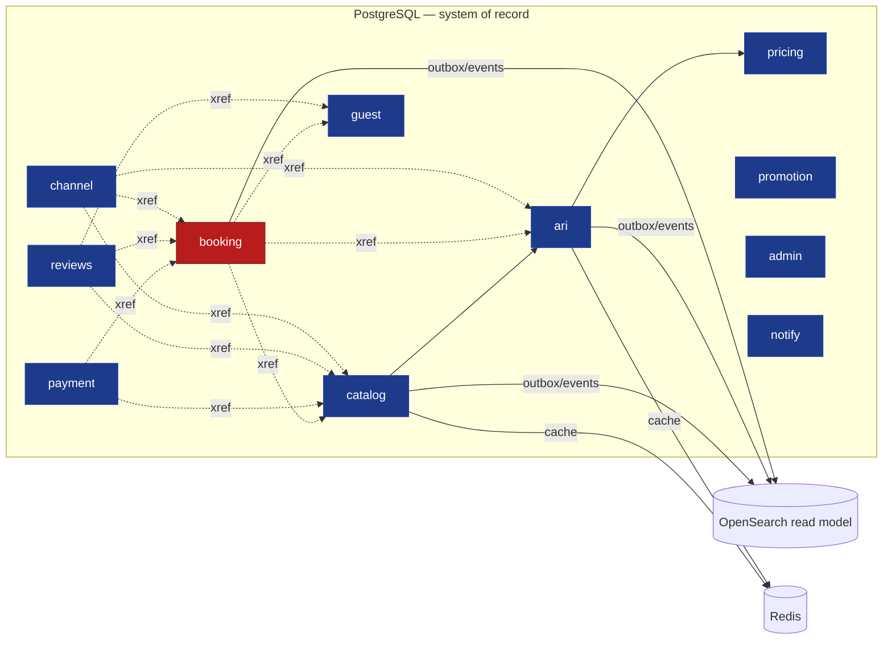
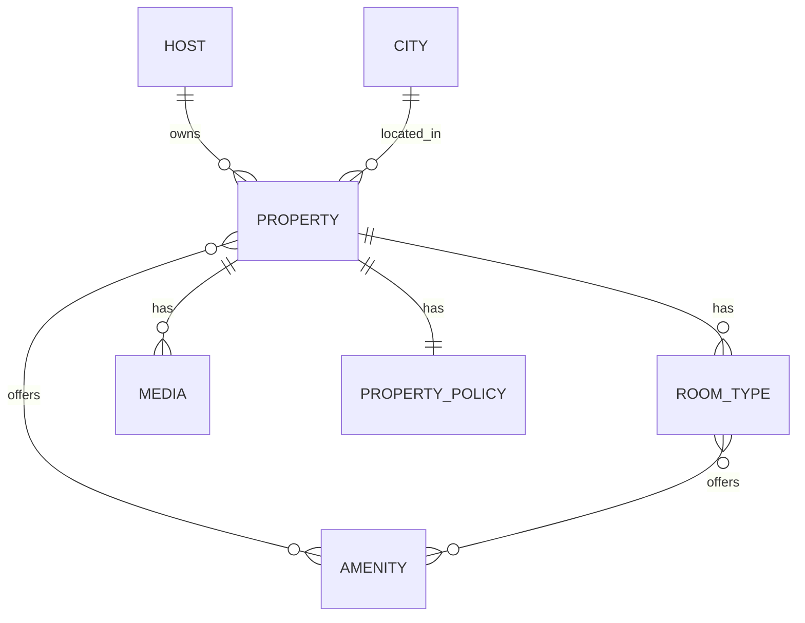
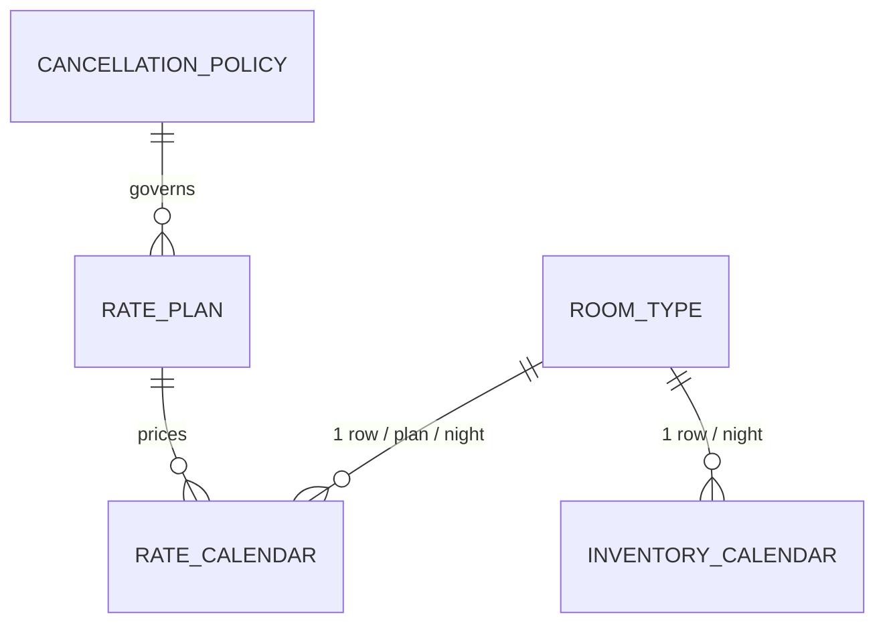
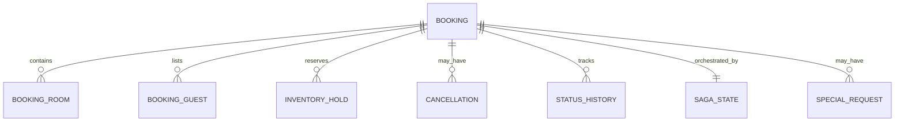
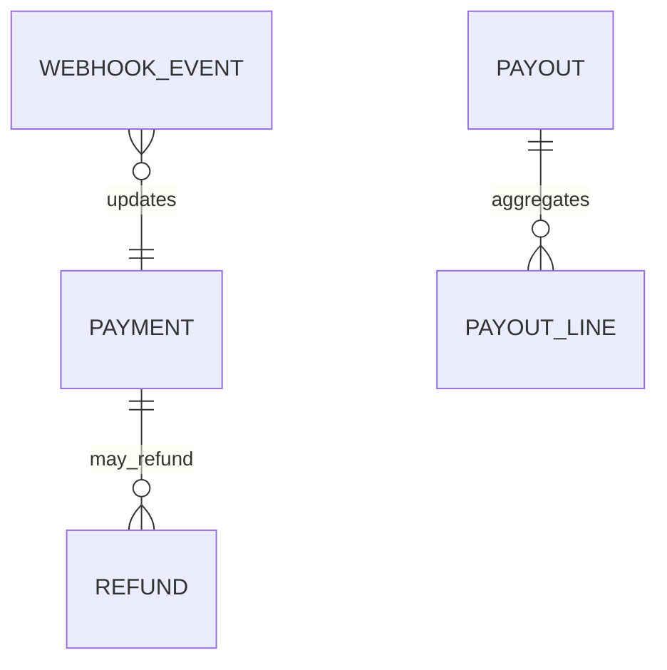

# Booking Platform — Database Design

**Companions:** *System Design* (architecture, flows) · *FRD v2* (UC-/INT-/BR-) · *Implementation Plan v2* · **`schema.sql`** (the complete, validated DDL)
**Status of `schema.sql`:** applied cleanly against PostgreSQL 16 + PostGIS; partitioning, the atomic-hold SQL, and the BR-1 oversell guard were functionally tested (see §9).

---

## 1. Datastore Inventory (polyglot persistence)

The platform is not one database. Each store is chosen for the access pattern it serves; the relational core is the system of record, everything else is derived and rebuildable.

| Store | Role | What lives here | Why this store |
|---|---|---|---|
| **PostgreSQL 16 (+PostGIS)** | System of record | All transactional contexts: catalog, ari, pricing, guest, booking, payment, reviews, promotion, channel, admin, notify | ACID, range partitioning for the calendars, geography type for search, mature .NET (EF Core/Npgsql) support, conditional-update concurrency |
| **OpenSearch / Elasticsearch** | Search read model | Denormalized property docs: geo, static facets, price band, rating | Sub-second geo + facet + full-text at scale; **never the source of truth** |
| **Redis** | Cache + coordination | Price/availability cache (1–5 min TTL), per-cart serialization lock, session carts, rate-limit counters | In-memory latency; atomic ops for the cart lock |
| **Object storage (S3/Blob)** | Media | Property/room images, videos, voucher/invoice PDFs | Cheap, CDN-frontable; DB stores only the `storage_key` |
| **Analytics warehouse** (e.g. BigQuery/Snowflake/ClickHouse) | OLAP | Funnel events, booking facts, reconciliation | Reporting must never touch transactional Postgres; fed from the event stream |

Identity/User and Notification are **external services** (FRD v2), so no credential, profile-of-record, or message-delivery storage lives here — only an `identity_sub` reference and a notification **emission ledger**.

---

## 2. Core Design Principles

1. **Schema-per-bounded-context.** Eleven PostgreSQL schemas, each owning its tables and its own EF Core migration history. One physical database during the modular-monolith phase; any schema can be lifted to its own database later.
2. **No cross-context foreign keys.** Real FKs exist only *within* a schema. Cross-context links are plain columns marked `xref:` with no constraint, so extraction never hits a dangling FK. Integrity across contexts is maintained by domain logic + events, not the database. This is the single most important rule for keeping the future-extraction seam clean.
3. **The database enforces the money-critical invariant.** `inventory_calendar` carries `CHECK (units_sold + units_held <= total_allotment)` — BR-1 (no overbooking) is a database guarantee, not just application discipline. Validated in §9.
4. **Optimistic concurrency by default, conditional updates on the hot path.** Every mutable aggregate has `row_version` (EF `[ConcurrencyCheck]`). The ARI hold path additionally uses an atomic conditional `UPDATE … WHERE available >= qty` with a row-count check.
5. **Outbox per writing context.** Each schema that emits events has an `outbox_message` table written in the same transaction as the state change — no dual-write to the bus.
6. **Money and time discipline.** `NUMERIC(12,2)` + explicit `CHAR(3)` currency, never float; `TIMESTAMPTZ` for instants; `DATE` for stay-nights with all window math in the property timezone (BR-4).

---

## 3. Context Map & Ownership



`booking` (red) is the only strongly-consistent transactional core; everything dotted is a cross-context `xref` with no FK.

**Table counts per context** (from the validated build): catalog 10 · ari 5 + 36 partitions · pricing 3 · guest 6 · booking 9 · payment 6 · reviews 4 · promotion 3 · channel 5 · admin 5 · notify 1.

---

## 4. Entity Relationships (per context)

### Catalog

`HOST.identity_sub` is the external user reference; KYC state is platform-owned.

### ARI (availability, rates, inventory)

`ROOM_TYPE` is an `xref` from catalog (no FK). Both calendars are `PARTITION BY RANGE (stay_date)`.

### Booking (transactional core)

`guest_id` is nullable (guest checkout uses `contact_email`). `nightly_breakdown` on `BOOKING_ROOM` is the frozen quote (BR-2).

### Payment

`idempotency_key` is `UNIQUE` on both payment and refund (BR-5); `webhook_event` de-dupes by `(psp, psp_event_id)`.

---

## 5. The ARI Calendars — the hard part

The two calendar tables are the highest-volume and highest-contention tables and get the most design attention.

**Partitioning.** Both `inventory_calendar` and `rate_calendar` are `PARTITION BY RANGE (stay_date)` with **monthly partitions**, created ahead by `ari.create_calendar_partitions(from, months)` (use pg_partman or a scheduled job in production). The PK includes `stay_date` because a partitioned table's primary key must contain the partition key. Benefits: the hot working set (next ~18 months) stays small and index-tight; old months become read-only and are archived via `DETACH PARTITION` rather than mass `DELETE`.

**The availability formula** is implicit: `available(night) = total_allotment - units_sold - units_held`. The `units_held` counter is the fast path; the `inventory_hold` table (in the `booking` context) exists for the expiry reaper and audit, not for per-request availability math.

**The atomic hold** (System Design §6.2) is one statement over the night range with a row-count check, giving all-nights-or-none without distributed locks:

```sql
WITH held AS (
  UPDATE ari.inventory_calendar
     SET units_held = units_held + :qty, row_version = row_version + 1
   WHERE room_type_id = :rt
     AND stay_date >= :checkIn AND stay_date < :checkOut
     AND stop_sell = false
     AND (total_allotment - units_sold - units_held) >= :qty
  RETURNING stay_date)
SELECT count(*) FROM held;   -- must equal nights; else ROLLBACK (no partial hold)
```

**The backstop** is the table CHECK constraint `units_sold + units_held <= total_allotment`. Even a buggy code path cannot oversell — the database rejects the write. Proven in §9, Test 3.

---

## 6. Indexing Strategy

Indexes are deliberate, not reflexive. Highlights:

- **Geo:** GiST on `property.geo` and `city.geo` for radius/viewport search (the candidate set still comes from OpenSearch in production; these serve admin/geo joins and fallback).
- **Partial indexes for hot, narrow predicates:** `property (city_id) WHERE status='LIVE'`, `booking (hold_expires_at) WHERE status='HELD'` (the reaper's scan), every `outbox_message (occurred_at) WHERE processed_at IS NULL`, `inventory_hold (expires_at) WHERE released=false`. Partial indexes keep the index tiny and the planner honest.
- **Foreign-key / lookup columns** indexed where they drive joins or filters (`booking.guest_id`, `payment.booking_id`, `review.property_id WHERE PUBLISHED`).
- **Uniqueness as correctness:** `payment.idempotency_key`, `refund.idempotency_key`, `webhook_event(psp,psp_event_id)`, `review.booking_id`, `notification_emission.event_id`, `guest_profile.identity_sub`, `host.identity_sub` — each enforces a business rule (idempotency, one-review-per-stay, one-profile-per-user).
- **Calendar PKs** double as the access path: `(room_type_id, stay_date)` and `(room_type_id, rate_plan_id, stay_date)` cover the hold and pricing reads directly.

---

## 7. Non-Relational Stores

### OpenSearch read model (one doc per property)
Denormalized for search; rebuilt from catalog/ARI events via the indexer; never authoritative.
```jsonc
{
  "property_id": 12345,
  "name": "...", "type": "VILLA", "star_rating": 4,
  "geo": { "lat": 1.39, "lon": 103.89 },          // geo_point
  "city_id": 88, "country_code": "SG",
  "amenities": ["WIFI","POOL","KITCHEN"],          // keyword facets
  "price_band": { "min": 120.00, "currency": "SGD" }, // coarse, for ranking/filter
  "rating": { "avg": 4.6, "count": 320 },
  "status": "LIVE", "updated_at": "..."
}
```
Exact price/availability for the displayed dates is resolved at query time against Redis/Pricing for the visible page only — the index holds a coarse band, so a rate change does not force a reindex of every doc.

### Redis key design
| Key pattern | Value | TTL | Purpose |
|---|---|---|---|
| `avail:{roomTypeId}:{checkIn}:{checkOut}:{qty}` | available? + price | 1–5 min | search/detail page acceleration |
| `cart:lock:{cartId}` | owner token | hold TTL | serialize double-submit (NOT inventory truth) |
| `session:cart:{cartId}` | cart JSON | 30 min | in-flight selection |
| `ratelimit:{partnerId}:{window}` | counter | window | partner API quotas |

### Object storage
`media.storage_key` and document keys reference S3/Blob; bytes never touch Postgres; served via CDN with signed URLs for private docs (voucher/invoice fallback per INT-N5).

---

## 8. Cross-Cutting Data Concerns

- **Identifiers.** `BIGINT GENERATED ALWAYS AS IDENTITY` within each context (clean, compact, per-context DBs avoid global collision); externally exposed handles use opaque codes (`booking.reference`, checksummed) rather than raw ids. UUIDv7 is a drop-in alternative if you later want client-generated ids — the `xref` rule makes that swap local to a context.
- **Multi-currency.** Amounts always paired with a currency; bookings snapshot `fx_rate_used` so a historical booking never re-converts (BR-2).
- **Timezones.** `property.timezone` (IANA) is the authority for check-in/cutoff/cancellation math (BR-4); the cancellation evaluator gets its own DST test matrix.
- **Privacy / erasure (BR-8).** Guest PII concentrates in `guest.*`, `booking.contact_*`, `booking_guest`, `saved_traveler.document`. Erasure anonymizes these while retaining financial records (`payment.*`, `payout.*`) under legal retention; the two-party workflow coordinates with the Identity Service (INT-I7). Consider application-level encryption for `saved_traveler.document`.
- **Audit.** `admin.audit_log` is append-only (privileged actions, BR-7); `booking.status_history` and `channel.ari_sync_log` give domain-level trails.
- **Tenancy (BR-9).** Host-owned data is reachable only via `host_id`/ownership; enforced by EF Core global query filters + tests that prove cross-tenant reads fail.

---

## 9. Validation Performed

`schema.sql` was applied to PostgreSQL 16 + PostGIS with `ON_ERROR_STOP=1` — **clean, zero errors**, all 11 schemas and 18×2 monthly partitions created. Functional checks:

| Test | Result |
|---|---|
| Atomic 3-night hold, qty 1 | Affects exactly 3 rows → proceed ✓ |
| One night full, 3-night hold attempted | Affects 2 rows → app sees `<3` → all-or-none reject ✓ |
| Oversell attempt (`units_sold=3 > allotment 2`) | **Rejected by DB CHECK constraint** ✓ |

This confirms the no-overbooking guarantee (BR-1) is enforced at the storage layer, not merely in application code — which is exactly what Gate G1 will load-test at concurrency.

---

## 10. What to Run

`schema.sql` is idempotent-friendly for a fresh database and ordered by dependency. In the build it is split into per-context EF Core migration sets (per the modular-monolith boundaries); the consolidated file is the canonical reference and the fast path for spinning up a local/dev database. Schedule `ari.create_calendar_partitions` monthly (or adopt pg_partman) so the future partition window never runs dry.
