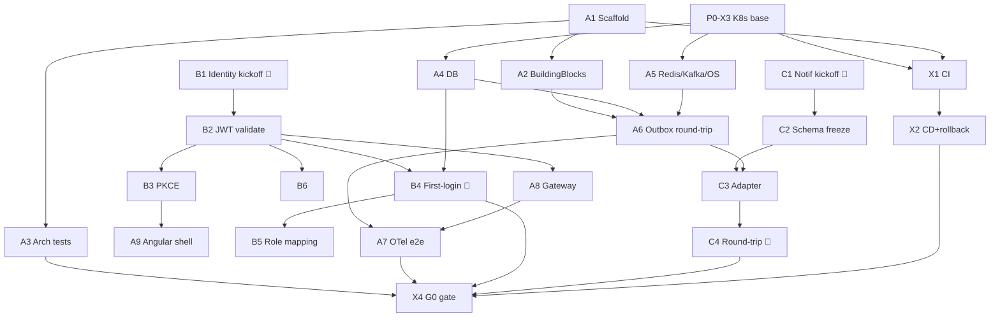

# Phase 0 — Foundation & Integrations · Sprint Backlog

**Phase:** 0 of 9 (Implementation Plan v2) · **Duration:** Weeks 1–4 (2 sprints × 2 weeks)
**Gate:** G0 (§7) · **Companions:** *Implementation Plan v2* §3 · *FRD v2* (UC-x, INT-x, OQ-x)

**Objective:** a walking skeleton in a prod-like environment with **both external integrations proven** — Identity login issues a usable token and provisions a platform profile; the NotificationAdapter delivers a real message via your existing service. Nothing business-domain ships in Phase 0; this is the rail everything else runs on.

**Team for this phase:** 3 backend, 1 frontend (shell only), 1 platform/DevOps, 1 SDET, 1 BA/architect (owns kickoffs + OQ closure).

---

## 1. Backlog Structure

Four epics: three are the plan's workstreams; one is the delivery rail.

| Epic | Name | Workstream |
|---|---|---|
| **E0-A** | Platform Foundation | A (platform engineering) |
| **E0-B** | Identity Integration | B |
| **E0-C** | Notification Integration | C |
| **E0-X** | Delivery & Environment (CI/CD, K8s) | cross-cutting |

Story IDs: `P0-<epic><n>`. Estimates in points (Fibonacci). Owner = primary role.

---

## 2. Epic E0-A — Platform Foundation

### P0-A1 · Solution scaffold & module skeleton `[5]` · Backend
Create the modular-monolith solution: `Platform.Gateway` + module projects (`Catalog, ARI, Pricing, Booking, Payment, Search, Reviews, NotificationAdapter, Admin`), each with `Domain / Application / Infrastructure / Api` projects, plus a `BuildingBlocks` shared project.
**AC**
- [ ] Solution builds clean; each module has the 4-layer structure.
- [ ] Module `Api` layers reference only their own `Application`; `Application` references only own `Domain` + `BuildingBlocks`; no module references another module's `Infrastructure`.
- [ ] A `*.Contracts` project exists per module for cross-module/public types; references between modules are contracts-only.
- [ ] README documents the layering rule.
**Deps:** none (start day 1). **Traces:** Plan §3-A.

### P0-A2 · BuildingBlocks library `[5]` · Backend
`Result<T>`/`Error` types, CQRS command/query abstractions + pipeline (validation, logging, transaction behaviors), outbox interfaces, messaging abstractions, base entity + `row_version` concurrency token.
**AC**
- [ ] `Result<T>` used for control flow (no exceptions for expected failures); unit-tested.
- [ ] CQRS pipeline runs a sample command through validation → handler → outbox behavior.
- [ ] Messaging abstraction (`IEventPublisher`, `IIntegrationEvent`) decouples modules from the broker SDK.
**Deps:** P0-A1. **Traces:** Plan §3-A.

### P0-A3 · Architecture boundary tests `[3]` · SDET + Backend
ArchUnitNET (or NetArchTest) suite enforcing module boundaries, run in CI.
**AC**
- [ ] Tests fail on: cross-module `Infrastructure` reference; `Domain` referencing `Api`; module referencing another module's non-`Contracts` project.
- [ ] A deliberately seeded violation is shown failing the build, then removed (proves the guard works).
- [ ] Wired into CI as a required check.
**Deps:** P0-A1. **Traces:** Plan §3-A, R7. **G0:** arch-test fails on seeded violation.

### P0-A4 · Database provisioning & per-module migrations `[5]` · DevOps + Backend
Provision Postgres with **PostGIS**; establish per-module schema + independent EF Core migration history.
**AC**
- [ ] Postgres reachable from dev/staging; PostGIS extension enabled.
- [ ] Each module owns a schema; migrations run per module, independently versioned.
- [ ] A trivial entity migrates end-to-end in CI (migrate-on-deploy or explicit job).
- [ ] Connection strings via external secrets, not in config.
**Deps:** P0-X3. **Traces:** Plan §3-A.

### P0-A5 · Redis / Kafka / OpenSearch provisioning `[5]` · DevOps
Stand up Redis, Kafka (or Azure Service Bus), and OpenSearch in dev/staging.
**AC**
- [ ] Each reachable from the cluster with health checks green.
- [ ] Kafka topic auto-creation policy decided (explicit topics preferred); a `platform.test` topic exists.
- [ ] Redis used by a smoke test (set/get); OpenSearch cluster green with a throwaway index.
**Deps:** P0-X3. **Traces:** Plan §3-A.

### P0-A6 · Transactional outbox + dispatcher round-trip `[8]` · Backend
Outbox table + dispatcher (Wolverine or MassTransit) proving DB-write → reliable publish → consume, with no dual-write.
**AC**
- [ ] Writing a domain event in the same transaction as a DB change lands it in `outbox_message`.
- [ ] Dispatcher publishes to Kafka and marks processed; at-least-once with idempotent consumer.
- [ ] A `TestEvent` round-trips: producer module → Kafka → consumer module logs receipt.
- [ ] Failure injection: kill dispatcher mid-batch → on restart, unprocessed events still publish exactly-effectively-once (consumer idempotent).
**Deps:** P0-A2, P0-A4, P0-A5. **Traces:** Plan §3-A, BR-5, BR-11.

### P0-A7 · OpenTelemetry end-to-end `[5]` · DevOps + Backend
Traces/metrics/logs from Gateway through modules to Kafka consumers; correlation id propagated from Angular.
**AC**
- [ ] A single browser request produces one trace spanning Gateway → module → Postgres → outbox → Kafka consumer, visible in the tracing UI.
- [ ] `traceparent` propagated from Angular; correlation id in structured logs.
- [ ] Baseline RED metrics (rate/errors/duration) per endpoint emitted.
**Deps:** P0-A6, P0-A8. **Traces:** Plan §3-A. **G0:** end-to-end traced request.

### P0-A8 · Gateway / BFF baseline `[3]` · Backend
YARP gateway with routing to modules, auth pass-through, and a health/aggregate endpoint.
**AC**
- [ ] Routes resolve to at least two module endpoints.
- [ ] Auth middleware (P0-B2) plugged in; unauthenticated calls to protected routes are 401.
- [ ] Per-route timeouts + a Polly resilience policy stub present.
**Deps:** P0-A1, P0-B2. **Traces:** Plan §3-A.

### P0-A9 · Angular 20 shell `[5]` · Frontend
Standalone/zoneless app shell: routing, signal-based state, auth interceptor, route guards, design-system seed.
**AC**
- [ ] App boots zoneless; a sample feature route renders with signal state.
- [ ] HTTP interceptor attaches the access token; guard redirects unauthenticated users to login.
- [ ] Design tokens + base components scaffolded (no business screens yet).
**Deps:** P0-B3. **Traces:** Plan §3-A.

---

## 3. Epic E0-B — Identity Integration

### P0-B1 · Identity integration kickoff & claims contract `[3]` · BA/Architect 🔴
Kickoff with the Identity team; **close OQ-5** (required claims) and confirm dev-tenant access + JWKS endpoint.
**AC**
- [ ] Claims contract (INT-I5) signed off: `sub, email, email_verified, name, locale?, phone?` (or agreed variant), versioned in the schema registry.
- [ ] Dev-tenant client registered for Angular (auth-code + PKCE) and confirmed for future client-credentials (INT-I6).
- [ ] JWKS URL + token lifetimes + key-rotation cadence documented.
- [ ] OQ-1 (KYC state location) resolved or recommendation (platform-owned) accepted in writing.
**Deps:** none — **Day 1, blocking.** **Traces:** OQ-5, OQ-1, INT-I5/I6. **G0 blocker.**

### P0-B2 · JWT validation middleware `[5]` · Backend
Validate Identity-issued JWTs: issuer, audience, signature via cached JWKS, expiry, clock-skew ≤60 s.
**AC**
- [ ] Valid token → authenticated principal with mapped claims; invalid → 401 with no fallback to weaker auth (INT-I1).
- [ ] JWKS cached locally; **key rotation** picked up without redeploy; cache survives brief Identity outage (INT-I8).
- [ ] Clock-skew tolerance configurable; covered by tests.
**Deps:** P0-B1. **Traces:** INT-I1, INT-I8.

### P0-B3 · Angular PKCE login flow `[5]` · Frontend
Authorization-code + PKCE against the Identity dev tenant; token storage, silent refresh, logout.
**AC**
- [ ] Login redirects to Identity, returns with a usable access token (INT-I2; no implicit flow).
- [ ] Refresh works; logout clears tokens + ends the session.
- [ ] Token stored per security review (memory/secure cookie, not localStorage for access tokens).
**Deps:** P0-B1, P0-A9. **Traces:** INT-I2. **G0:** login → JWT → protected endpoint.

### P0-B4 · First-login provisioning (UC-5.1a) `[8]` · Backend 🔴
On first valid token whose `sub` has no platform profile, create one — idempotent and race-safe.
**AC**
- [ ] Unique constraint on `sub`; first request creates the profile, hydrates cached identity attrs from claims, assigns default `guest` role.
- [ ] **10 concurrent first-requests → exactly one profile, no errors surfaced** (loser re-reads).
- [ ] Re-entrant: replaying the provisioning path never duplicates or errors (BR-5).
- [ ] Missing `email_verified` → browse allowed, booking-confirm blocked behind a policy flag (E2).
**Deps:** P0-B2, P0-A4. **Traces:** UC-5.1a, INT-I3, BR-5. **G0:** profile created exactly once under concurrency.

### P0-B5 · Role mapping & resolver `[3]` · Backend
Platform-owned mapping from Identity claims/groups → platform roles (`guest/host/ops/moderator/finance/partner`), grantable without Identity-side change.
**AC**
- [ ] Mapping table seeded; resolver applies platform roles per request from claims + table.
- [ ] An ops user can grant `host`/`ops` in-platform; takes effect on next token without Identity edits (INT-I4).
- [ ] Policy-based authorization attributes wired for at least one protected endpoint per role.
**Deps:** P0-B4. **Traces:** UC-12.1, INT-I4.

### P0-B6 · Identity negative & resilience tests `[3]` · SDET
**AC**
- [ ] Expired, malformed, wrong-audience, wrong-issuer tokens all rejected.
- [ ] Key-rotation drill: rotate signing key → validation recovers via JWKS refresh, no redeploy.
- [ ] Identity-outage drill: with Identity down, already-authenticated requests + anonymous browse still work; only new logins fail gracefully (INT-I8).
**Deps:** P0-B2, P0-B4. **Traces:** INT-I8, R11.

---

## 4. Epic E0-C — Notification Integration

### P0-C1 · Notification integration kickoff `[3]` · BA/Architect 🔴
Kickoff with the Notification team; **close OQ-3 (raw-email delivery for guest checkout) and OQ-6 (transport: bus vs REST)**; surface OQ-2 (attachments) and OQ-7 (preference ownership).
**AC**
- [ ] OQ-3 answered: can the service deliver to a raw email without a user record? If no → fallback (require account at checkout for launch) documented + escalated.
- [ ] OQ-6 answered: transport chosen (async bus topic preferred).
- [ ] OQ-2 answered: attachment support; if no → link fallback (INT-N5) accepted.
- [ ] OQ-7 answered: per-category opt-out ownership (INT-N3); default = platform-side suppress if undecided.
**Deps:** none — **Day 1, blocking.** **Traces:** OQ-2/3/6/7, INT-N1/N3/N5. **G0 blocker.**

### P0-C2 · Notification command schema freeze `[3]` · Backend + BA
Freeze the platform→Notification command contract under schema-registry versioning.
**AC**
- [ ] Schema fields: `event_id, category, recipient (sub | raw contact), locale, data` (INT-N1).
- [ ] Registered + versioned; additive-only evolution policy documented.
- [ ] At least the Phase-3 categories (`booking_confirmed`, `host_new_booking`) modeled with example payloads.
**Deps:** P0-C1. **Traces:** INT-N1, INT-N2.

### P0-C3 · NotificationAdapter module `[5]` · Backend
Outbox consumer → maps platform domain events to Notification commands → emits via chosen transport → records an emission ledger (BR-11).
**AC**
- [ ] Consumes a domain event, builds the command, emits via the agreed transport.
- [ ] Emission ledger row per command, keyed by `event_id` (audit + dedupe).
- [ ] Saga/business code never blocks on emission (fire-and-forget through outbox).
**Deps:** P0-C2, P0-A6. **Traces:** INT-N1, BR-11, UC-10.x foundation.

### P0-C4 · End-to-end round-trip proof `[5]` · Backend + SDET 🔴
Prove a real message lands via the existing Notification Service, idempotently.
**AC**
- [ ] Synthetic `TestNotificationEvent` → adapter → Notification Service → **message delivered to a dev inbox/number**.
- [ ] Same `event_id` emitted ×5 → exactly one delivery (idempotency at the boundary, BR-5).
- [ ] Notification-Service-down drill: bus buffering/retry absorbs it; platform unaffected; delivery catches up on recovery.
**Deps:** P0-C3. **Traces:** INT-N1, BR-5/BR-11. **G0:** notification round trip idempotent.

### P0-C5 · Template ownership decision & session booking `[2]` · BA/Architect
**AC**
- [ ] INT-N2 decided: Notification renders templates from platform data (preferred) vs platform-supplied bodies.
- [ ] Template-design sessions for Phase-3 categories booked on the Notification team's calendar (lead-time per Plan §14, week-14 sign-off needed).
**Deps:** P0-C1. **Traces:** INT-N2, Plan §14.

---

## 5. Epic E0-X — Delivery & Environment

### P0-X1 · CI pipeline `[5]` · DevOps
GitHub Actions: build → unit tests → arch-tests → container build → push.
**AC**
- [ ] Every PR runs build + tests + arch-tests as required checks.
- [ ] Container images built + pushed on merge to main; trunk-based flow documented.
**Deps:** P0-A1. **Traces:** Plan §3-A.

### P0-X2 · CD pipeline + rollback `[5]` · DevOps
Helm deploy to dev/staging on merge; demonstrable rollback.
**AC**
- [ ] Merge to main auto-deploys to dev; staging via promotion.
- [ ] **Rollback to previous release demonstrated** (one command / one click).
- [ ] DB migrations run safely in the deploy pipeline (expand/contract policy noted).
**Deps:** P0-X1, P0-X3. **Traces:** Plan §3-A. **G0:** CI deploys on merge; rollback demonstrated.

### P0-X3 · Kubernetes baseline `[5]` · DevOps
Namespaces, external-secrets operator, ingress, cert-manager (TLS), HPA stubs.
**AC**
- [ ] dev + staging namespaces; secrets sourced externally (no secrets in manifests/repo).
- [ ] Ingress + TLS via cert-manager; a sample service reachable over HTTPS.
- [ ] HPA stubs present (scaling tuned later).
**Deps:** none (start day 1). **Traces:** Plan §3-A.

### P0-X4 · G0 gate harness & sign-off `[3]` · SDET
Assemble the G0 checklist as an executable/scripted verification + sign-off record.
**AC**
- [ ] Each G0 item (§7) maps to an automated check or a recorded manual drill.
- [ ] Sign-off doc produced; failures block Phase 1 start.
**Deps:** all G0-contributing stories. **Traces:** G0.

---

## 6. Dependency Graph (critical edges)

The two **🔴 kickoffs (B1, C1) start on day 1** and gate the whole identity/notification chains — they're the real schedule risk, not the code.

---

## 7. Two-Sprint Plan

### Sprint 1 (Weeks 1–2) — *Unblock & lay rails* · ~45 pts
Day-1 must-starts: **P0-B1, P0-C1** (kickoffs), **P0-X3, P0-A1**.

| Story | Pts | Story | Pts |
|---|---|---|---|
| P0-B1 Identity kickoff 🔴 | 3 | P0-A4 DB + migrations | 5 |
| P0-C1 Notif kickoff 🔴 | 3 | P0-A5 Redis/Kafka/OS | 5 |
| P0-A1 Scaffold | 5 | P0-X1 CI | 5 |
| P0-A2 BuildingBlocks | 5 | P0-X3 K8s base | 5 |
| P0-A3 Arch tests | 3 | P0-B2 JWT validate | 5 |
| P0-C2 Schema freeze | 3 | | |

**Sprint-1 exit:** infra up; scaffold + boundaries enforced in CI; both contracts frozen; JWT validation working; OQ-3/5/6 closed (or fallbacks accepted).

### Sprint 2 (Weeks 3–4) — *Prove it end-to-end* · ~48 pts

| Story | Pts | Story | Pts |
|---|---|---|---|
| P0-A6 Outbox round-trip | 8 | P0-B4 First-login 🔴 | 8 |
| P0-A8 Gateway | 3 | P0-B5 Role mapping | 3 |
| P0-A7 OTel e2e | 5 | P0-B6 Identity neg/resilience | 3 |
| P0-A9 Angular shell | 5 | P0-C3 NotificationAdapter | 5 |
| P0-B3 PKCE login | 5 | P0-C4 Round-trip proof 🔴 | 5 |
| P0-X2 CD + rollback | 5 | P0-C5 Template decision | 2 |
| | | P0-X4 G0 gate sign-off | 3 |

**Sprint-2 exit = Gate G0.**

> Total ~93 pts over 4 weeks. If velocity runs short, the safe cuts are P0-A9 (shell can trail into Phase 1) and P0-B5 (role mapping needed by Phase 1, not G0). Never cut B1/C1/B4/C4/A6 — they *are* the phase.

---

## 8. Gate G0 — Exit Checklist (→ owning stories)

- [ ] End-to-end traced request browser → Kafka consumer — *A7 (via A6, A8)*
- [ ] Real Identity login → JWT → protected endpoint — *B2, B3*
- [ ] First-login profile created exactly once under 10 concurrent first-requests — *B4*
- [ ] Notification round trip delivered + idempotent (event ×5 → 1 delivery) — *C3, C4*
- [ ] OQ-3, OQ-5, OQ-6 formally closed or fallback accepted — *B1, C1*
- [ ] CI deploys on merge; rollback demonstrated — *X1, X2*
- [ ] Arch-test proven to fail on a seeded violation — *A3*

All seven green → **Phase 1 (Catalog & Host Core) starts.**

---

## 9. Definitions

**Definition of Ready** (before a story enters a sprint): AC written + testable; dependencies merged or scheduled same sprint; estimate agreed; any external-team need raised in the §14 dependency calendar.

**Definition of Done** (per story): code + tests (unit/integration, and the gate scenario where applicable) green in CI; OTel spans named where it adds a span; deployed to staging; AC checked off in review; docs/runbook note if operational.

---

## 10. Phase-0 Risks

| # | Risk | Mitigation |
|---|---|---|
| P0-R1 | Identity/Notification kickoffs slip → whole chain blocked | B1/C1 are day-1; 2-week escalation rule (Plan §14); fallbacks pre-written |
| P0-R2 | OQ-3 negative (no raw-email delivery) late | Decided in Sprint 1; fallback = account-before-checkout for launch, escalate immediately (conversion cost) |
| P0-R3 | Outbox/exactly-once semantics underestimated | A6 is 8 pts + failure-injection AC; senior backend owns it |
| P0-R4 | First-login race conditions slip to prod | B4 concurrency AC is explicit; unique constraint + test enforce it before G0 |
| P0-R5 | Boundaries erode once feature work starts | A3 in CI from Sprint 1; non-negotiable required check |

---

## 11. Next Action

Schedule **P0-B1 and P0-C1 for day 1** with the Identity and Notification teams — every other story in this phase ultimately waits on the answers those two meetings produce.
