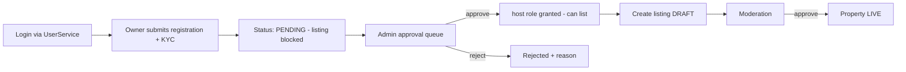
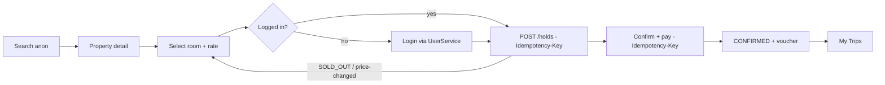

# Stay — Frontend Runbooks

Operational + developer runbooks for the two Stay frontends. Split into `stay-portal/RUNBOOK.md` and `jap-stay-app/RUNBOOK.md` if you prefer per-app files. Rules here build on `docs/engineering-standards.md` §2 (frontend) and §3 (API contract) — this is the *how to run and operate* layer.

| App | Folder | Audience | Role |
|---|---|---|---|
| **Back office** | `stay-portal` | Property owners + platform admin/ops | Owner registration, admin approval, property/ARI/booking/earnings management |
| **End-user** | `jap-stay-app` | Guests | The booking funnel — search → book → manage trips |

Both authenticate against **UserService** (OIDC) and reach the backend through the **Ocelot Gateway** at `/stay/api/v1`. **No guest checkout** — booking actions require login.

---

# Part A — Back Office (`stay-portal`, Angular 20)

## A1. Run locally
Prereqs: Node 20+, Angular CLI, the `Stay.Api` running (directly or via the gateway), a UserService dev tenant.

```bash
cd stay-portal
npm install
# configure src/environments/environment.development.ts:
#   apiBaseUrl: 'http://localhost:8080/stay/api/v1'   (gateway) or direct Stay.Api URL
#   oidc: { authority, clientId: 'stay-portal', redirectUri: 'http://localhost:4200/auth/callback', scope: 'openid profile stay.portal' }
ng serve            # http://localhost:4200
```
Connects to: Gateway → `Stay.Api` (REST), UserService (OIDC). For pure-frontend work, point `apiBaseUrl` at a mock or the running API.

## A2. Structure
```
stay-portal/
  src/app/
    core/         # auth, http interceptors, guards, api client (generated from OpenAPI)
    shared/       # design system, components, pipes
    features/
      auth/       # login redirect + callback + pending-approval
      owner/      # owner-scoped feature routes
      admin/      # admin/ops feature routes
    app.routes.ts
```
Standalone components, zoneless, signals for state. Typed reactive forms. API client generated from `Stay.Api` OpenAPI (keep in sync).

## A3. Routes & screens (role-gated)
| Route | Role | Screen |
|---|---|---|
| `/auth/login`, `/auth/callback` | anon | OIDC redirect + token exchange |
| `/pending` | owner (unapproved) | "Awaiting approval" — listing routes blocked |
| `/owner/dashboard` | owner | summary, status |
| `/owner/register` | owner | KYC/business/payout/tax submission |
| `/owner/properties` · `/owner/properties/:id` · `/new` | owner | listing CRUD |
| `/owner/properties/:id/rooms` | owner | room types/units |
| `/owner/properties/:id/calendar` | owner | ARI — rates, availability, restrictions (bulk date-range editor) |
| `/owner/properties/:id/media` | owner | media upload (StorageService presigned) |
| `/owner/bookings` · `/owner/earnings` | owner | bookings, payout statements |
| `/admin/approvals` · `/admin/approvals/:id` | admin | **owner approval queue + decision** |
| `/admin/moderation` | moderator | listing/media DRAFT→LIVE gate |
| `/admin/users` | admin | platform role assignment |

## A4. Core journey — owner onboarding & approval (the portal's reason to exist)

The approval gate is enforced **server-side** (an unapproved owner's listing-create call is rejected) — the UI `/pending` state is convenience, not the control.

## A5. Auth
OIDC auth-code + **PKCE** against UserService (client `stay-portal`). Access token **in memory**; refresh via secure `HttpOnly` cookie or silent renew — never `localStorage`. Route guards: `ownerGuard`, `adminGuard`; an authenticated-but-unapproved owner is routed to `/pending`. Interceptor attaches the token + `traceparent`, surfaces `problem+json` uniformly.

## A6. Backend dependencies
Catalog (properties/rooms/media), ARI (rates/availability/restrictions), Admin (approval, roles, moderation), Booking (owner bookings view), Payment (payout statements) — all via `/stay/api/v1` behind the gateway.

## A7. Build & deploy
```bash
ng build --configuration production       # → dist/ static assets
```
Serve as static assets (container/nginx or CDN-fronted bucket) behind the gateway or its own host. CI: GitHub Actions — lint, test, **bundle-budget check (<250 KB gz initial)**, Lighthouse budget, build, deploy. Rollback = redeploy the previous build artifact.

## A8. Operational notes & troubleshooting
- **Monitoring:** RUM + error tracking (e.g. Sentry); Lighthouse budget in CI; watch auth-callback failures and 403s.
- **Token expiry** → silent renew; if renew fails, redirect to login (don't trap the user).
- **403 on listing create** → owner not approved (expected) or role not yet in token (re-login to refresh claims).
- **CORS errors** → origin not allowlisted at the API/gateway.
- **Stale data / type errors** → API client out of sync with OpenAPI; regenerate.
- **Feature flags** for incomplete admin tooling; ship dark, flip per environment.

---

# Part B — End-user (`jap-stay-app`, mobile)

> Stack-agnostic: match your existing `jap-*-app` mobile stack. The integration rules below apply regardless of framework.

## B1. Run locally
Prereqs: your mobile toolchain; `Stay.Api` reachable via gateway; UserService mobile OIDC client (PKCE with an app redirect scheme/deep link).

Config:
- `apiBaseUrl` = gateway `…/stay/api/v1`
- OIDC: authority (UserService), `clientId: 'jap-stay-app'`, redirect = custom scheme / universal link, `scope: 'openid profile stay.guest'`
- Build/run per platform target.

## B2. Screens & navigation
| Screen | Auth | Notes |
|---|---|---|
| Onboarding / Login | anon→token | login required before booking |
| Home / Search | anon | destination, dates, guests |
| Results (list + map) | anon | cursor-paginated, cached |
| Property detail | anon | gallery, amenities, policies, reviews |
| Room & rate selection | anon | live price/avail (advisory) |
| Checkout — guest details | **token** | prefilled from profile |
| Checkout — payment | **token** | RazorPay via PaymentGateway |
| Confirmation / voucher | **token** | reference + StorageService voucher link |
| My Trips (upcoming/past) | **token** | cursor-paginated |
| Booking detail / cancel / modify | **token** | policy-based refund |
| Profile / Wishlist | **token** | preferences, saved properties |
| Post-stay review | **token** | verified stays only |

## B3. Core journey — the booking funnel


## B4. Auth
OIDC auth-code + **PKCE** with the app redirect scheme. Tokens in **secure platform storage** (Keychain / Keystore) — never plain prefs. Browse/search is anonymous; **hold/confirm/cancel/profile require a valid Bearer token** (enforced API-side). Refresh on expiry; on refresh failure, prompt re-login without losing the in-progress search.

## B5. API dependencies (`/api/v1`)
`GET /search` · `GET /properties/{id}` · `GET /properties/{id}/availability` · `POST /holds` (token, Idempotency-Key) · `POST /bookings/{id}/confirm` (token, Idempotency-Key) · `GET /bookings` (token) · `POST /bookings/{id}/cancel` (token, Idempotency-Key) · `GET /me` (token). Generate the API client from `Stay.Api` OpenAPI.

## B6. Build & deploy
Build per platform → internal distribution (TestFlight / Play internal track) → store release. **Versioning:** the app sends its version; the API supports `/api/v1` with a deprecation window — implement **forced-update** when the app version drops below the minimum the live API supports.

## B7. Operational notes & troubleshooting
- **Retries are idempotent.** Mobile networks drop; every state-changing call carries an `Idempotency-Key` so a retried hold/confirm never double-acts. Honor `Retry-After` on 429/503.
- **`hold-expired` / `price-changed` / `sold-out`** are first-class `problem+json` types — the app branches on them (re-quote, re-select), not on HTTP status alone.
- **Push** via NotificationService (booking confirmation, reminders) — register the device token post-login; the app does not poll.
- **Crash + API monitoring:** crash reporting (e.g. Crashlytics) + API error-rate dashboards; alert on confirm-failure spikes.
- **Caching:** respect `ETag`/`Cache-Control` on search/detail; never cache authenticated booking responses.
- **API version mismatch** is the most common field incident → forced-update flow + clear messaging.

---

## Shared notes (both apps)
- One published OpenAPI from `Stay.Api` is the single source for both clients' generated API layers — regenerate on contract change.
- All times are ISO-8601 with offset + the property timezone; clients localize. Amounts always carry currency.
- Rate limiting + auth enforcement live at the gateway and API, not the client — clients handle `429`/`401`/`403` gracefully.
- Gate G4 (soft launch) requires both: the portal's owner-onboarding+approval working end-to-end, and the mobile funnel green against `/api/v1` with the G1 no-overbooking invariant holding under load.
