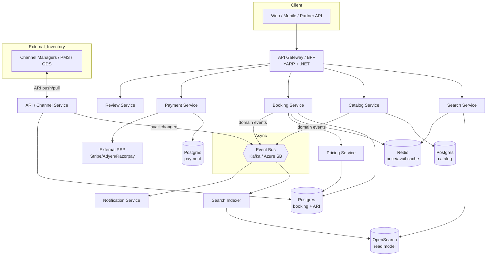
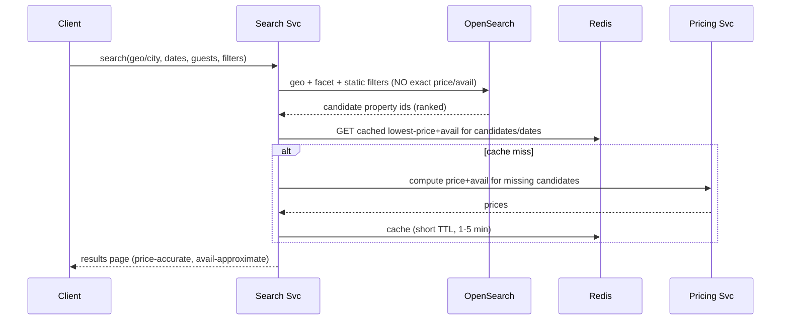
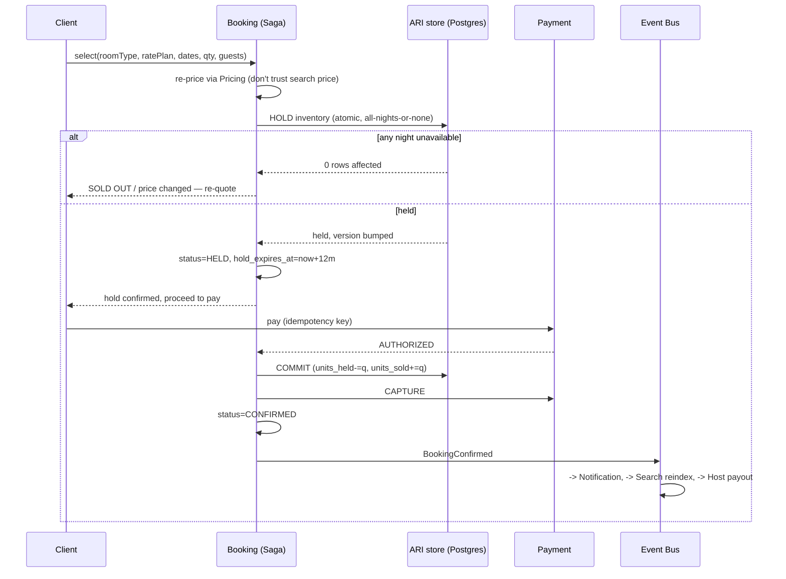
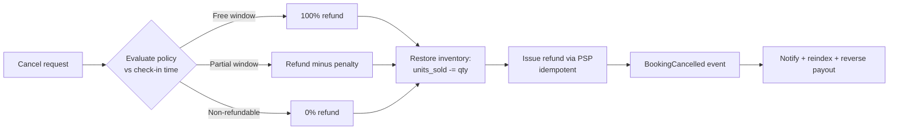
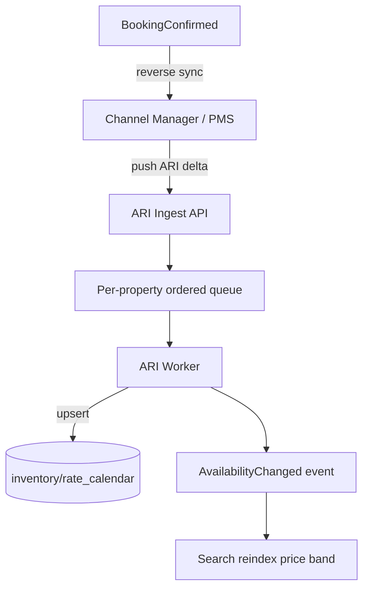

# Hotel / Stay / Villa Booking Platform — System Design

**Target:** Agoda / MakeMyTrip-class OTA + direct-booking platform
**Backend stack:** .NET 10 / C# 14
**Author scope:** Architecture, data model, core flows, concurrency, scalability

---

## 1. Scope & Assumptions

This design covers a multi-tenant booking platform that sells **rooms** (hotels), **whole units** (villas/apartments), and **homestays** through a single inventory abstraction. It must support:

- High read fan-out search (millions of properties, sub-second results, geo + date + price filtering).
- Strongly consistent booking (no overbooking) under heavy concurrency.
- Third-party inventory sync (Channel Managers / PMS / GDS) **and** direct hosts.
- Flexible pricing (seasonal, occupancy-based, length-of-stay, promos, multi-currency, taxes by jurisdiction).
- Payment orchestration with refunds, partial captures, and split settlement to hosts.

**Assumptions made** (call them out so you can challenge them):

1. Cloud-agnostic but assuming Kubernetes + a managed Postgres, a managed Kafka/Service Bus, Redis, and OpenSearch/Elasticsearch.
2. Identity is handled by your existing IAM platform (OIDC/JWT) — this design consumes it, doesn't rebuild it.
3. Start as a **modular monolith with hard module boundaries**, deployable as services later. Rationale in §4.

---

## 2. Bounded Contexts (Domain Decomposition)

Model the domain first; the service map falls out of it. Eight contexts:

| Context | Owns | Consistency need |
|---|---|---|
| **Catalog** | Property, RoomType/Unit, Amenities, Media, Policies | Eventually consistent (read-heavy) |
| **ARI** (Availability, Rates, Inventory) | Daily inventory, daily rates, restrictions, channel sync | Strong within a stay-date window |
| **Pricing** | Rate plans, occupancy/LOS rules, taxes, promo application, currency | Deterministic, stateless compute |
| **Search** | Denormalized read model, ranking, geo index | Eventually consistent |
| **Booking** | Cart, holds, reservations, cancellation, saga orchestration | **Strong** — the integrity core |
| **Payment** | Gateway abstraction, auth/capture/refund, host payouts | Strong + idempotent |
| **Reviews** | Ratings, moderation, aggregates | Eventually consistent |
| **Notification** | Email/SMS/push templating + dispatch | At-least-once |

Booking is the only context that must be strongly consistent and transactional. Everything read-facing (Catalog, Search, Reviews) can be eventually consistent and aggressively cached. This split is the single most important decision in the design.

---

## 3. High-Level Architecture



**Key idea:** writes hit the transactional Postgres stores; an event stream projects denormalized data into OpenSearch and Redis for reads. Booking never reads from the search index for availability truth — it reads from the ARI store under lock.

---

## 4. Why Modular Monolith First (then extract)

You're optimizing for *flexibility and future-proofing*, which people often misread as "microservices from day one." For a domain this coupled (Booking ↔ Pricing ↔ ARI all participate in one transaction), premature service splits create distributed transactions you don't need yet.

**Recommendation:** one ASP.NET Core solution, modules as separate projects with **no shared mutable state and only contract-level references**:

```
src/
  Platform.Gateway/              # YARP BFF
  Modules/
    Catalog/        (Domain, Application, Infrastructure, Api)
    ARI/
    Pricing/
    Booking/
    Payment/
    Search/
    Reviews/
    Notification/
  BuildingBlocks/                # CQRS, outbox, messaging, result types
```

Enforce boundaries at compile time (e.g., `Booking` may reference `Pricing.Contracts` but never `Pricing.Infrastructure`). Use an architecture test (NetArchTest / ArchUnitNET) in CI to fail the build on boundary violations. When a module needs independent scaling (Search and Pricing are the first candidates), it lifts out into its own deployable with the contract already defined. This is the same bug-flagging-over-papering-over discipline applied to architecture.

**Tech stack per module:**
- **Vertical-slice + CQRS**: MediatR-style pipeline (or hand-rolled to avoid the new licensing concerns), `Result<T>` instead of exceptions for control flow.
- **EF Core 10** for the transactional write side; **Dapper** for hot read queries and the ARI conditional updates where you want raw SQL control.
- **Transactional Outbox** for reliable event publishing (no dual-write between DB and bus).
- **Wolverine or MassTransit** for messaging + saga orchestration.
- **OpenTelemetry** end-to-end (you already run this — reuse the collector).

---

## 5. Database Design

### 5.1 Persistence strategy

Polyglot, **database-per-context** (logical separation even inside the monolith — separate schemas, separate migration histories):

- **Postgres** — system of record for Catalog, ARI, Booking, Payment. (PostGIS for geo; range partitioning for the calendar tables; row-level concurrency.) SQL Server is a fine substitute given your stack — swap `tsrange`/PostGIS for equivalents and `xmin`/`version` for `rowversion`.
- **OpenSearch/Elasticsearch** — search read model only (never source of truth).
- **Redis** — distributed locks, hold counters, price/availability cache, rate limiting.
- **Object storage (S3/Blob)** — media; DB stores keys only.

### 5.2 Catalog schema

```sql
CREATE TABLE property (
    id              BIGINT GENERATED ALWAYS AS IDENTITY PRIMARY KEY,
    host_id         BIGINT NOT NULL,
    name            TEXT NOT NULL,
    property_type   TEXT NOT NULL,         -- HOTEL | VILLA | APARTMENT | HOMESTAY | RESORT
    description      TEXT,
    star_rating     SMALLINT,
    status          TEXT NOT NULL DEFAULT 'DRAFT', -- DRAFT|LIVE|SUSPENDED
    -- geo (PostGIS)
    geo             GEOGRAPHY(POINT, 4326) NOT NULL,
    country_code    CHAR(2) NOT NULL,
    city_id         BIGINT NOT NULL,
    address         JSONB NOT NULL,        -- structured address
    default_currency CHAR(3) NOT NULL,
    timezone        TEXT NOT NULL,         -- IANA, for check-in/cutoff math
    check_in_time   TIME, check_out_time TIME,
    created_at      TIMESTAMPTZ NOT NULL DEFAULT now(),
    updated_at      TIMESTAMPTZ NOT NULL DEFAULT now(),
    row_version     INTEGER NOT NULL DEFAULT 0
);
CREATE INDEX idx_property_geo  ON property USING GIST (geo);
CREATE INDEX idx_property_city ON property (city_id) WHERE status = 'LIVE';

CREATE TABLE room_type (
    id              BIGINT GENERATED ALWAYS AS IDENTITY PRIMARY KEY,
    property_id     BIGINT NOT NULL REFERENCES property(id),
    name            TEXT NOT NULL,
    unit_kind       TEXT NOT NULL,         -- ROOM | ENTIRE_UNIT  (villa = ENTIRE_UNIT)
    total_units     INT NOT NULL,          -- physical inventory owned
    base_occupancy  SMALLINT NOT NULL,
    max_occupancy   SMALLINT NOT NULL,
    max_adults      SMALLINT, max_children SMALLINT,
    bed_config      JSONB,
    size_sqm        NUMERIC(6,1),
    row_version     INTEGER NOT NULL DEFAULT 0
);

-- Amenities: master + M:N, supports facet search
CREATE TABLE amenity (id BIGINT GENERATED ALWAYS AS IDENTITY PRIMARY KEY,
    code TEXT UNIQUE NOT NULL, category TEXT NOT NULL, label TEXT NOT NULL);
CREATE TABLE property_amenity (property_id BIGINT, amenity_id BIGINT,
    PRIMARY KEY (property_id, amenity_id));

CREATE TABLE media (
    id BIGINT GENERATED ALWAYS AS IDENTITY PRIMARY KEY,
    property_id BIGINT, room_type_id BIGINT,
    storage_key TEXT NOT NULL, kind TEXT NOT NULL, -- IMAGE|VIDEO|360
    sort_order INT NOT NULL DEFAULT 0, is_primary BOOLEAN DEFAULT false);
```

### 5.3 ARI — the hard part

Availability, Rates and Inventory are **date-keyed** and are the highest-volume, highest-contention tables in the system. Each `(room_type, stay_date)` is one night of sellable inventory. Separate inventory from rates because channel managers update them independently and they have different write patterns.

```sql
-- INVENTORY: one row per room_type per night. Range-partitioned by month.
CREATE TABLE inventory_calendar (
    room_type_id     BIGINT NOT NULL,
    stay_date        DATE   NOT NULL,
    total_allotment  INT    NOT NULL,           -- units offered for sale that night
    units_sold       INT    NOT NULL DEFAULT 0,
    units_held       INT    NOT NULL DEFAULT 0, -- transient holds (carts in flight)
    stop_sell        BOOLEAN NOT NULL DEFAULT false,
    min_los          SMALLINT,                  -- restrictions
    max_los          SMALLINT,
    closed_to_arrival   BOOLEAN NOT NULL DEFAULT false,
    closed_to_departure BOOLEAN NOT NULL DEFAULT false,
    row_version      INTEGER NOT NULL DEFAULT 0,
    PRIMARY KEY (room_type_id, stay_date)
) PARTITION BY RANGE (stay_date);
-- available(night) = total_allotment - units_sold - units_held

-- RATES: base price per room_type/rate_plan/night, partitioned the same way.
CREATE TABLE rate_calendar (
    room_type_id  BIGINT NOT NULL,
    rate_plan_id  BIGINT NOT NULL,
    stay_date     DATE   NOT NULL,
    base_price    NUMERIC(12,2) NOT NULL,
    currency      CHAR(3) NOT NULL,
    -- occupancy pricing: price deltas keyed by guest count
    occupancy_prices JSONB,    -- e.g. {"1": -20.00, "3": 15.00}
    PRIMARY KEY (room_type_id, rate_plan_id, stay_date)
) PARTITION BY RANGE (stay_date);

CREATE TABLE rate_plan (
    id BIGINT GENERATED ALWAYS AS IDENTITY PRIMARY KEY,
    property_id BIGINT NOT NULL,
    name TEXT NOT NULL,                 -- "Flexible", "Non-refundable"
    meal_plan TEXT,                     -- ROOM_ONLY|BREAKFAST|HALF_BOARD...
    cancellation_policy_id BIGINT NOT NULL,
    is_refundable BOOLEAN NOT NULL);
```

**Partitioning:** monthly range partitions on `stay_date`. Past partitions become read-only and are cheap to archive; future partitions are pre-created by a scheduled job. This keeps the hot working set (next ~18 months) small and index-friendly, and lets you drop old data with `DETACH PARTITION` instead of mass deletes.

**Why a held counter on the row instead of computing from a holds table:** at booking-page concurrency you cannot afford an aggregate query per availability check. The counter is the fast path; a separate `inventory_hold` table exists only for the expiry reaper and audit (§6.2).

### 5.4 Booking schema

```sql
CREATE TABLE booking (
    id            BIGINT GENERATED ALWAYS AS IDENTITY PRIMARY KEY,
    reference     TEXT UNIQUE NOT NULL,        -- human-facing code
    guest_user_id BIGINT NOT NULL,
    property_id   BIGINT NOT NULL,
    status        TEXT NOT NULL,               -- DRAFT|HELD|CONFIRMED|CANCELLED|NO_SHOW|COMPLETED
    currency      CHAR(3) NOT NULL,
    total_amount  NUMERIC(12,2) NOT NULL,
    tax_amount    NUMERIC(12,2) NOT NULL,
    hold_expires_at TIMESTAMPTZ,               -- set while HELD
    created_at    TIMESTAMPTZ NOT NULL DEFAULT now(),
    row_version   INTEGER NOT NULL DEFAULT 0
);

CREATE TABLE booking_room (
    id           BIGINT GENERATED ALWAYS AS IDENTITY PRIMARY KEY,
    booking_id   BIGINT NOT NULL REFERENCES booking(id),
    room_type_id BIGINT NOT NULL,
    rate_plan_id BIGINT NOT NULL,
    check_in     DATE NOT NULL,
    check_out    DATE NOT NULL,                -- [check_in, check_out) nights
    quantity     INT  NOT NULL,
    adults SMALLINT, children SMALLINT,
    nightly_breakdown JSONB NOT NULL,          -- frozen per-night price at booking time
    subtotal     NUMERIC(12,2) NOT NULL
);

CREATE TABLE booking_guest (
    id BIGINT GENERATED ALWAYS AS IDENTITY PRIMARY KEY,
    booking_id BIGINT NOT NULL, full_name TEXT, is_lead BOOLEAN);

-- transient holds for the reaper + audit
CREATE TABLE inventory_hold (
    id UUID PRIMARY KEY,
    booking_id BIGINT NOT NULL,
    room_type_id BIGINT NOT NULL,
    stay_date DATE NOT NULL,
    quantity INT NOT NULL,
    expires_at TIMESTAMPTZ NOT NULL,
    released BOOLEAN NOT NULL DEFAULT false);
CREATE INDEX idx_hold_expiry ON inventory_hold (expires_at) WHERE released = false;

-- outbox for reliable eventing
CREATE TABLE outbox_message (
    id UUID PRIMARY KEY, type TEXT NOT NULL, payload JSONB NOT NULL,
    occurred_at TIMESTAMPTZ NOT NULL, processed_at TIMESTAMPTZ);
```

### 5.5 Payment schema

```sql
CREATE TABLE payment (
    id BIGINT GENERATED ALWAYS AS IDENTITY PRIMARY KEY,
    booking_id BIGINT NOT NULL,
    psp        TEXT NOT NULL,                  -- STRIPE|ADYEN|RAZORPAY
    psp_ref    TEXT,                           -- gateway transaction id
    intent_id  TEXT,
    amount     NUMERIC(12,2) NOT NULL,
    currency   CHAR(3) NOT NULL,
    status     TEXT NOT NULL,                  -- AUTHORIZED|CAPTURED|FAILED|REFUNDED|VOIDED
    idempotency_key TEXT UNIQUE NOT NULL,      -- de-dupes retries
    created_at TIMESTAMPTZ NOT NULL DEFAULT now());

CREATE TABLE refund (
    id BIGINT GENERATED ALWAYS AS IDENTITY PRIMARY KEY,
    payment_id BIGINT NOT NULL, amount NUMERIC(12,2) NOT NULL,
    reason TEXT, status TEXT NOT NULL, psp_ref TEXT);
```

Every PSP call carries an **idempotency key** derived from `booking.id + attempt`, so retries after a timeout never double-charge.

---

## 6. Core Flows

### 6.1 Search flow



OpenSearch holds **static attributes + geo + a precomputed price band** for ranking and coarse filtering — it does *not* hold per-night truth. Exact price and availability for the displayed dates are resolved against Redis/Pricing for just the page of candidates. This keeps the index small and avoids re-indexing on every rate change. The availability shown in search is best-effort; truth is only asserted at hold time (§6.2), which is correct — never block the funnel on perfect search-time availability.

### 6.2 Booking flow — hold → pay → confirm (the overbooking-safe path)

This is a **saga** orchestrated by the Booking service. The critical section is the inventory hold.



**The atomic multi-night hold** — one statement, check the row count equals the number of nights:

```sql
WITH held AS (
  UPDATE inventory_calendar
     SET units_held = units_held + :qty,
         row_version = row_version + 1
   WHERE room_type_id = :roomTypeId
     AND stay_date >= :checkIn AND stay_date < :checkOut
     AND stop_sell = false
     AND (total_allotment - units_sold - units_held) >= :qty
  RETURNING stay_date
)
SELECT count(*) FROM held;     -- must equal (checkOut - checkIn) nights
```

If `count < nights`, the transaction rolls back and the whole stay is rejected — no partial holds. This makes "no overbooking" a property of a single SQL statement rather than application-level coordination. Lock ordering is implicit (Postgres locks the matched rows; the date predicate gives a consistent order), avoiding deadlocks between concurrent stays.

**Hold expiry / compensation:** a background reaper scans `inventory_hold WHERE expires_at < now() AND released = false`, decrements `units_held`, and marks the hold released. If payment fails or the client abandons, the same release path fires immediately as a saga compensation. **Confirm** moves `units_held → units_sold` atomically, so the night's `available` is unchanged at the moment of truth — the hold already reserved it.

**Why not just optimistic concurrency on a "rooms left" field?** Because a stay spans N nights and you need all-or-nothing across N rows. The conditional `UPDATE ... WHERE available >= qty` with a row-count check gives you that atomically without distributed locking. Redis locks are used only to *serialize the saga per cart* (prevent a double-submit creating two holds), not as the inventory truth.

### 6.3 Cancellation & refund flow

Refund amount is derived from the rate plan's cancellation policy evaluated against `now` vs `check_in` (in the property's timezone — this is a common bug source):



Inventory is returned to the pool *before* the refund call so the night becomes sellable immediately; the refund is a separate idempotent step that can retry independently.

### 6.4 Channel Manager / ARI sync

Hosts using a PMS (or aggregated through a channel manager) push ARI updates and pull bookings. Two-way sync with conflict handling:



- **Ordering matters:** ARI updates for one property must apply in order, so partition the ingest queue by `property_id` (Kafka key = property_id). Out-of-order allotment updates cause phantom availability.
- **Idempotency:** every ARI push carries a sequence/version; stale updates are dropped.
- **Reverse sync:** confirmed/cancelled bookings flow back to the PMS so the host's own calendar decrements. This is where most real overbooking originates — a sale on another channel that didn't sync back. Mitigate with short sync intervals + a periodic full-snapshot reconciliation.

---

## 7. Pricing Engine

Keep pricing **stateless and deterministic** — same inputs always yield the same quote — so it's trivially cacheable and testable. Pipeline:

```
base_price(night)                       -- from rate_calendar
  → occupancy adjustment                -- guests vs base_occupancy
  → length-of-stay / seasonal rules
  → promotions & coupons (stackable rules with priority)
  → currency conversion (snapshot FX rate, store the rate used)
  → taxes & fees (jurisdiction rules by country/city)
  = final quote (with full per-night, per-line breakdown)
```

Model rules as data, not code, so new pricing strategies don't require deploys:

```sql
CREATE TABLE pricing_rule (
    id BIGINT GENERATED ALWAYS AS IDENTITY PRIMARY KEY,
    scope_type TEXT NOT NULL,      -- PROPERTY|ROOM_TYPE|RATE_PLAN
    scope_id   BIGINT NOT NULL,
    rule_type  TEXT NOT NULL,      -- LOS_DISCOUNT|EARLY_BIRD|SEASONAL|OCCUPANCY
    priority   INT NOT NULL,
    conditions JSONB NOT NULL,     -- {"min_nights":7} etc.
    effect     JSONB NOT NULL,     -- {"discount_pct":10}
    valid_from DATE, valid_to DATE);
```

Always **freeze the computed breakdown onto `booking_room.nightly_breakdown`** at hold time. The quote the guest saw is the contract; never recompute against live rates after booking.

---

## 8. Scalability, Caching, Resilience

- **Read scaling:** Postgres read replicas for Catalog; OpenSearch shards by region; Redis for price/avail cache (1–5 min TTL) and session carts.
- **Write hot spot is ARI.** It's already partitioned by date. Shard further by `property_id` hash if a single Postgres instance saturates — booking transactions are naturally scoped to one property, so cross-shard transactions don't arise.
- **Caching layers:** CDN for media + static property pages → Redis for price bands → in-process memory for reference data (amenities, tax tables).
- **Resilience:** Polly for retries/circuit breakers on PSP and channel-manager calls; bulkhead PSP calls so a slow gateway can't exhaust threads. Saga compensation guarantees no orphaned holds or charges.
- **Idempotency everywhere external:** PSP, channel sync, and the public booking API all key on an idempotency token.

---

## 9. Cross-Cutting Concerns

- **Observability:** OpenTelemetry traces spanning the full booking saga (search → hold → pay → confirm); a single trace id from the gateway. Business metrics: hold-to-confirm conversion, hold expiry rate, overbooking incidents (should be zero), ARI sync lag.
- **Security:** OIDC/JWT from your IAM platform; role separation (guest / host / ops / partner-API); PCI scope minimized by never touching raw card data — tokenize at the PSP. Row-level tenancy checks on host data.
- **Multi-currency / i18n:** store amounts with explicit currency, snapshot FX rates onto bookings, all timestamps `TIMESTAMPTZ`, do check-in/cutoff math in the property's IANA timezone.
- **Data lifecycle:** detach + archive old calendar partitions; GDPR/PDPA — bookings carry PII, so support guest data export/erasure (anonymize, keep financial records).

---

## 10. Future-Proofing (the "futuristic" bit)

The design leaves clean seams for things you'll likely want next:

1. **Ranking/personalization service** — swap OpenSearch's static ranking for a learned model (conversion-optimized) without touching the booking core.
2. **Dynamic pricing / yield management** — `pricing_rule` is data-driven; an ML pricing engine writes to `rate_calendar` like any other channel.
3. **Marketplace/payout splits** — Payment context already isolates host settlement; add escrow/split-pay providers behind the same abstraction.
4. **New inventory types** — flights, experiences, packages — become new Catalog property types + their own ARI; the booking saga generalizes since it's already inventory-agnostic.
5. **Service extraction** — Search and Pricing lift out first (independent scaling, stateless); the module contracts are already the service contracts.

---

## 11. Suggested Build Order

1. Catalog + ARI write path (no channel sync yet) → seed test inventory.
2. Pricing engine (stateless) + the atomic hold SQL — prove no-overbooking under a concurrency load test *before* anything else.
3. Booking saga (hold → mock-pay → confirm) + reaper.
4. Payment integration (one PSP) with idempotency.
5. Search indexer + OpenSearch read model.
6. Channel manager ingest (the operationally hardest piece — do it once the core is solid).
7. Reviews, notifications, loyalty.

Step 2's concurrency test is the gate that proves the whole design holds up. Run it with thousands of concurrent holds on a single scarce room-night and assert `units_sold` never exceeds `total_allotment`.
